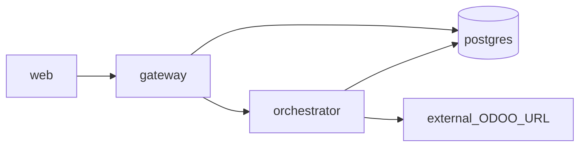

# Docker Compose strategy

## Goals

- One Compose definition for local and Linux.
- Control-plane services only; Odoo (and other SoRs) remain external dependencies.
- Volumes for Postgres and file storage; paths configurable via env.
- NestJS `gateway` is the **application** API entry; optional host TLS/WAF sits outside Compose (see [platform-concerns](../../Development/platform-concerns.md)).

## Environments

| Env | Notes |
|-----|--------|
| local | Developers copy `.env.example` → `.env`; run Postgres via Compose and apps via npm or `--profile apps` |
| linux | Install Docker Engine + Compose; same compose file; stronger secrets; host bind mounts for `STORAGE_ROOT` and backups |

## Containers

| Service | Public? | Notes |
|---------|---------|--------|
| `web` | yes (UI) | Calls gateway only |
| `gateway` | yes (API) | Auth, tenant, rate limit, logging correlation |
| `orchestrator` | **no** (internal) | Retry/backoff + circuit toward connectors |
| `postgres` | **no** | Control-plane DB (tenant-scoped when multi-tenant lands) |
| Redis | omit by default | Add only if shared rate-limit/queue across replicas is required |
| Odoo / other SoRs | external | Via connector env URLs — not in this Compose file |

## Dependency graph

- `web` → `gateway`
- `gateway` → `orchestrator` and `postgres`
- `orchestrator` → `postgres` and external connector URLs (Odoo is **not** in Compose)

## Checklist — run the system

Use this order so dependencies are up before callers.

### 1. Prerequisites

- [ ] Copy `.env.example` → `.env` (never commit `.env`)
- [ ] Set `DATABASE_URL` to host Postgres (default port **5433**)
- [ ] Set `NEXT_PUBLIC_GATEWAY_URL=http://localhost:3001`
- [ ] Set `ORCHESTRATOR_URL=http://localhost:8000` (local npm) or Compose service URL when using profile `apps`
- [ ] Decide ERP mode: `ERP_MODE=simulate` (no Odoo) or `live` with `ODOO_URL` / `ODOO_DB` / credentials
- [ ] Docker Engine available for Postgres (and optional app containers)

### 2. Postgres (required by gateway + orchestrator)

- [ ] `docker compose -f docker/docker-compose.yml up -d`
- [ ] Wait until Postgres is healthy (`docker compose … ps`)
- [ ] `npm run prisma:generate` and `npm run prisma:push` (schema for tasks + ERP connector)

### 3. Orchestrator → postgres + external ODOO_URL

- [ ] Activate `apps/orchestrator` venv and install `requirements.txt` (first time)
- [ ] Export `STORAGE_ROOT`, `ERP_MODE` / `ODOO_MODE`
- [ ] If `live`: set `ODOO_URL`, `ODOO_DB`, `ODOO_USERNAME`, and `ODOO_API_KEY` or `ODOO_PASSWORD`
- [ ] Start: `uvicorn app.main:app --reload --port 8000` from `apps/orchestrator`
- [ ] Check: `GET http://localhost:8000/health`

### 4. Gateway → orchestrator + postgres

- [ ] Export `DATABASE_URL`, `STORAGE_ROOT`, `ORCHESTRATOR_URL=http://localhost:8000`, `ERP_MODE`
- [ ] Start: `npm run start:prod -w @control-panel-erp/gateway` or `npm run dev:gateway`
- [ ] Check: `GET http://localhost:3001/health`
- [ ] Optional: `POST http://localhost:3001/integrations/odoo/test` (ERP connector health)

### 5. Web → gateway

- [ ] Start: `npm run dev:web`
- [ ] Open `http://localhost:3000`
- [ ] Confirm UI can reach gateway (`/console`, `/integrations/odoo`, `/tasks`, `/logs`)

### 6. Smoke path (end-to-end)

- [ ] Integrations page: save/test connector (or stay on `simulate`)
- [ ] Console: create a **dry_run** task for an allowlisted intent
- [ ] Task detail shows domain evidence; correlation id works in `/logs`
- [ ] Orchestrator wrote evidence under `STORAGE_ROOT/evidence/…` when applicable

### Optional — all apps in Compose

- [ ] `docker compose -f docker/docker-compose.yml --profile apps up -d --build`
- [ ] Same dependency order applies inside Compose; Odoo still external via `ODOO_URL`

## Hardening (later)

- Non-root users in Dockerfiles
- Healthchecks on gateway / orchestrator / web
- Resource limits
- Secrets via files or secret manager (not plaintext in git)
- Publish only `web` + `gateway` (and external TLS proxy); orchestrator on internal network only
- Tenant-aware `DATABASE_URL` / migrations when multi-tenant ships
- Optional infra proxy (Traefik/nginx/Cloudflare) for TLS/WAF — **not** a second Nest-style gateway
