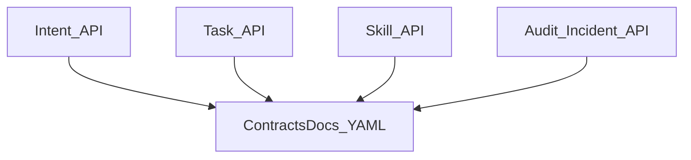

# API contracts samples — Diagrams

**Status:** docs-complete (Epic-01 scaffold)  
**Related:** [SRD](./SRD.md) · [TSD](./TSD.md) · [conops](./conops.md)

## Implements

Four contract types share common schemas; domain YAML files specialize operations.
