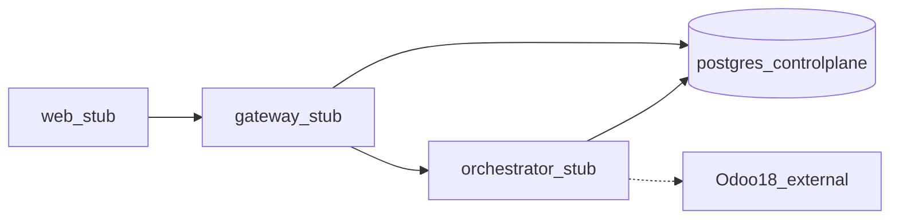

# Docker Compose strategy — Diagrams

**Status:** docs-complete (Epic-01 scaffold)  
**Related:** [SRD](./SRD.md) · [TSD](./TSD.md) · [conops](./conops.md)

## Implements

Odoo is external; control-plane Postgres is the only DB in Compose.
