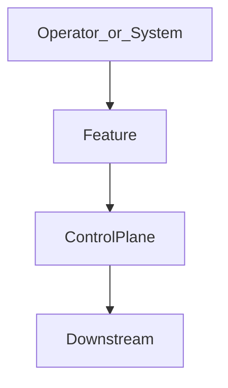

# Request console — Diagrams

**Related:** [SRD](./SRD.md) · [TSD](./TSD.md) · [conops](./conops.md)

## Implements

```mermaid
flowchart TD
  A[Operator_or_System] --> B[Feature]
  B --> C[ControlPlane]
  C --> D[Downstream]
```

Refine during implementation (gateway, orchestrator, Odoo adapter, or storage).
