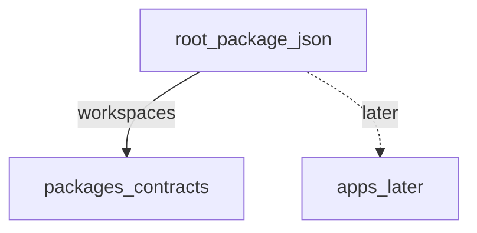

# npm workspaces — Diagrams

**Status:** planned (Epic-02 implementation)  
**Related:** [SRD](./SRD.md) · [TSD](./TSD.md) · [conops](./conops.md)

## Implements

```mermaid
flowchart TB
  Root[root_package_json]
  Contracts[packages_contracts]
  FutureApps[apps_later]
  Root -->|workspaces| Contracts
  Root -.->|later| FutureApps
```
