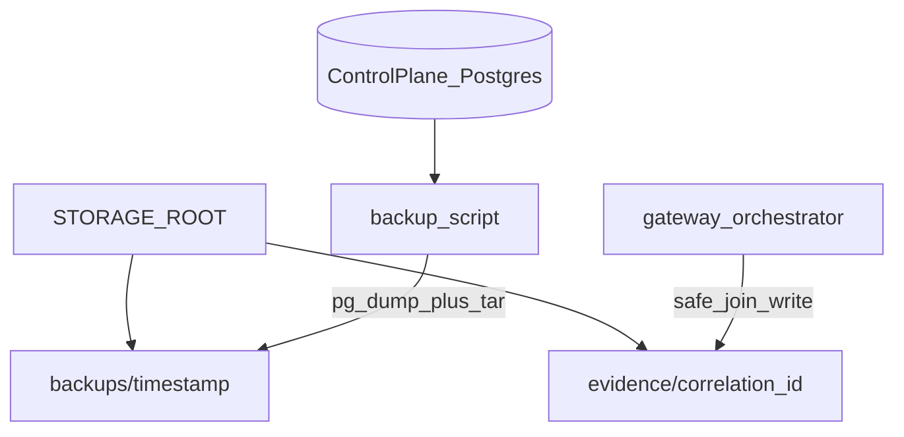
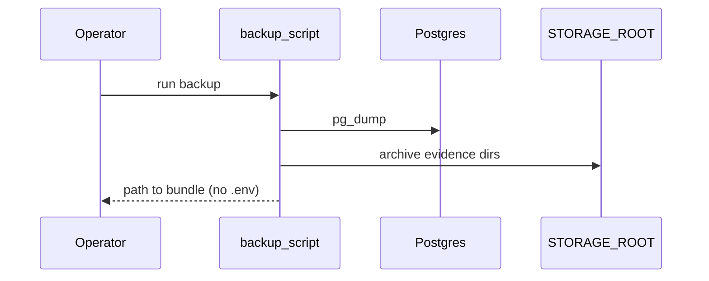

# Storage and backups — Diagrams

**Related:** [SRD](./SRD.md) · [TSD](./TSD.md) · [conops](./conops.md)

## Layout

```mermaid
flowchart TB
  Root[STORAGE_ROOT]
  Ev[evidence/correlation_id]
  Bk[backups/timestamp]
  Root --> Ev
  Root --> Bk
  Apps[gateway_orchestrator] -->|safe_join_write| Ev
  Script[backup_script] -->|pg_dump_plus_tar| Bk
  PG[(ControlPlane_Postgres)] --> Script
```

## Backup flow

```mermaid
sequenceDiagram
  participant Op as Operator
  participant Scr as backup_script
  participant PG as Postgres
  participant FS as STORAGE_ROOT
  Op->>Scr: run backup
  Scr->>PG: pg_dump
  Scr->>FS: archive evidence dirs
  Scr-->>Op: path to bundle (no .env)
```
