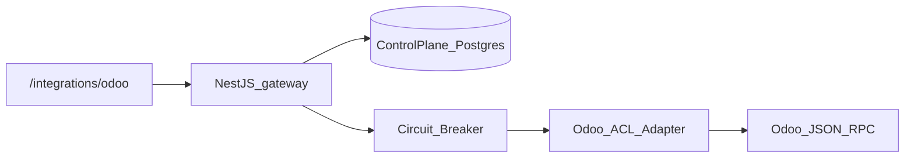
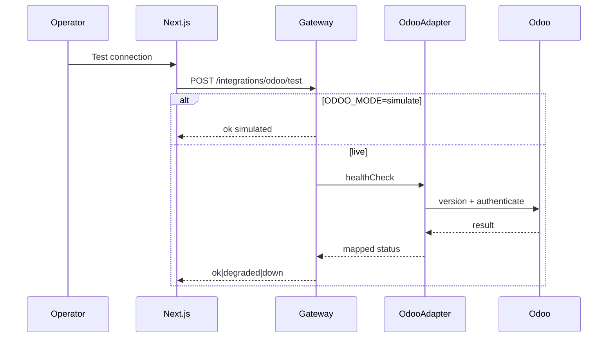

# Odoo integration — Diagrams

**Related:** [SRD](./SRD.md) · [TSD](./TSD.md) · [conops](./conops.md)

## Components

```mermaid
flowchart LR
  UI["/integrations/odoo"]
  Gw[NestJS_gateway]
  PG[(ControlPlane_Postgres)]
  ACL[Odoo_ACL_Adapter]
  CB[Circuit_Breaker]
  Odoo[Odoo_JSON_RPC]
  UI --> Gw
  Gw --> PG
  Gw --> CB
  CB --> ACL
  ACL --> Odoo
```

## Test connection sequence

```mermaid
sequenceDiagram
  participant Op as Operator
  participant Web as Next.js
  participant Gw as Gateway
  participant Ad as OdooAdapter
  participant Od as Odoo
  Op->>Web: Test connection
  Web->>Gw: POST /integrations/odoo/test
  alt ODOO_MODE=simulate
    Gw-->>Web: ok simulated
  else live
    Gw->>Ad: healthCheck
    Ad->>Od: version + authenticate
    Od-->>Ad: result
    Ad-->>Gw: mapped status
    Gw-->>Web: ok|degraded|down
  end
```
