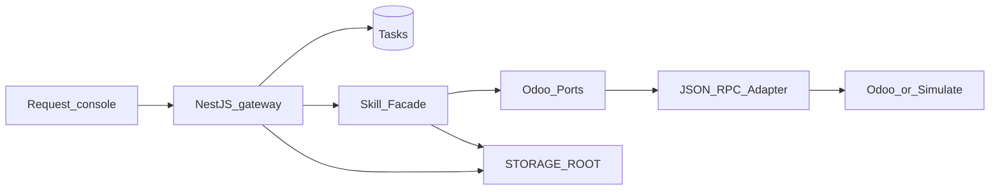
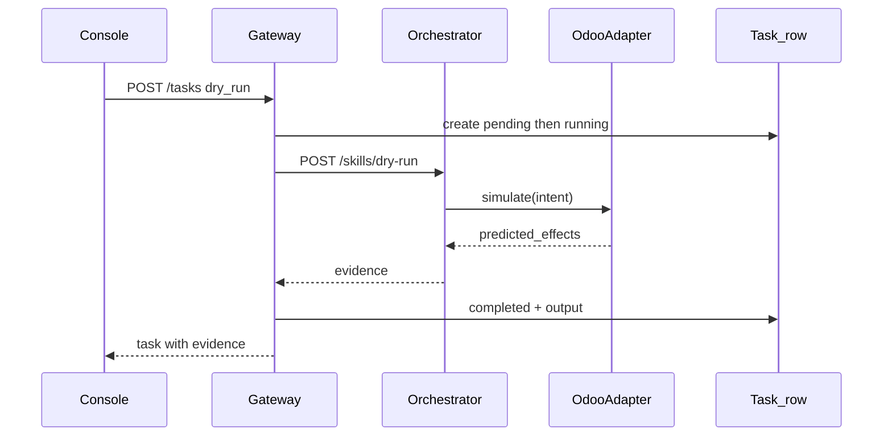

# Dry-run execution path — Diagrams

**Related:** [SRD](./SRD.md) · [TSD](./TSD.md) · [conops](./conops.md)

## Runtime

```mermaid
flowchart LR
  Console[Request_console]
  Gw[NestJS_gateway]
  PG[(Tasks)]
  Orch[Skill_Facade]
  Port[Odoo_Ports]
  Ad[JSON_RPC_Adapter]
  Od[Odoo_or_Simulate]
  Store[STORAGE_ROOT]
  Console --> Gw
  Gw --> PG
  Gw --> Orch
  Orch --> Port
  Port --> Ad
  Ad --> Od
  Orch --> Store
  Gw --> Store
```

## Dry-run sequence

```mermaid
sequenceDiagram
  participant UI as Console
  participant Gw as Gateway
  participant Orch as Orchestrator
  participant Ad as OdooAdapter
  participant T as Task_row
  UI->>Gw: POST /tasks dry_run
  Gw->>T: create pending then running
  Gw->>Orch: POST /skills/dry-run
  Orch->>Ad: simulate(intent)
  Ad-->>Orch: predicted_effects
  Orch-->>Gw: evidence
  Gw->>T: completed + output
  Gw-->>UI: task with evidence
```
