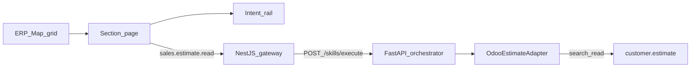

# Epic-05 — ERP Map & first live read skill

## Status

done (Epic-05 phase-01)

Operator-facing **ERP Map** (Odoo-style module grid), per-section **intent sub-sidebar**, deterministic **execution profiles**, and the first **live read** skill: `sales.estimate.read` → SCT `customer.estimate.search_read`.

**Depends on:** Epic-02 (contracts), Epic-03 (gateway/web shell), Epic-04 (Odoo connector + orchestrator ACL)

## Goal

Give managers a browsable map of ERP modules and intents (so they do not guess codes), then prove the live read path with **one** allowlisted skill against the real SCT estimate model — without opening general Odoo writes.

## Locked defaults

- **Epic id:** `Epic-05`
- **Domain language:** taxonomy intents (`sales.estimate.*`); Odoo models only inside adapters
- **Live skill allowlist (this epic):** `sales.estimate.read` only
- **Odoo model:** `customer.estimate` (custom module `customer_estimate`, not `sale.order`)
- **Modes:** `ODOO_MODE` / `ERP_MODE` = `live|simulate`; simulate returns deterministic dummy rows
- **Auth:** keep Epic-03 **dev-actor** (`X-Actor-Id`)
- **Mutations / NL compose / diagnostics:** catalogued in UI profiles for the future; **not** executed live in this epic
- **Patterns first:** cite chosen patterns in each task TSD

## Patterns applied (epic-level)

| Concern | Pattern | Doc |
|---------|---------|-----|
| Isolate Odoo model from UI/API | [Anti-Corruption Layer](../../Software%20Patterns%20Docs/Distributed_system_patterns/15-anti-corruption-layer.md) | `EstimatePort` ↔ `customer.estimate` |
| Skill ports | [Hexagonal Architecture](../../Software%20Patterns%20Docs/Architectural%20Patterns/05-hexagonal-architecture.md) | Facade → EstimatePort |
| JSON-RPC vendor API | [Adapter](../../Software%20Patterns%20Docs/Structural%20Patterns/Adapter.md) | `OdooEstimateAdapter` |
| Skill entry | [Facade](../../Software%20Patterns%20Docs/Structural%20Patterns/Facade.md) | `SkillExecutionFacade.execute` |
| BFF | [API Gateway](../../Software%20Patterns%20Docs/Distributed_system_patterns/01-api-gateway.md) | `POST /skills/execute` |
| Trace | [Correlation Identifier](../../Software%20Patterns%20Docs/Messaging_Integration_patterns/19-correlation-identifier.md) | gateway → orchestrator |
| Evidence | [Observability](../../Software%20Patterns%20Docs/DevOps_Delivery_patterns/06-observability.md) | `STORAGE_ROOT/evidence/…` |
| Dual nav | [Sidebar / progressive disclosure](../../Software%20Patterns%20Docs/) | Main menu + intents rail |

## Phase

| Phase | Focus |
|-------|--------|
| [phase-01](./phase-01/) | ERP Map UI + intent catalog + live estimate read |

## Build order

1. **ERP Map & section shell** — module grid, section routes, dual sidebar intents rail  
2. **Intent catalog & profiles** — per-section intents, call-path diagram, deterministic difficulty  
3. **Live `sales.estimate.read`** — EstimatePort, `/skills/execute`, UI live table  

## Out of scope

- Live create/update/cancel/diagnose/NL compose skills
- Expanding execute allowlist beyond `sales.estimate.read`
- Full SSO/RBAC
- Embedding Odoo UI

## Acceptance

- Epic-05 docs exist with three task packs and pattern citations.
- `/` shows Odoo-style module grid; `/sections/:slug` shows unique intent rail + search.
- Intent detail shows objective, description, call-path, execution profile, output table.
- `sales.estimate.read` with `ODOO_MODE=live` returns real `customer.estimate` rows via gateway.
- Simulate mode still works without Odoo.
- No secrets committed; `.env` stays local.
