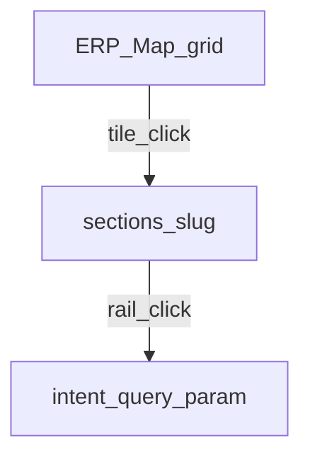

# ERP Map & section shell — Diagrams

**Related:** [SRD](./SRD.md) · [TSD](./TSD.md) · [conops](./conops.md)

## Layout

```mermaid
flowchart LR
  Main[Main_menu]
  Intents[List_of_intents]
  Content[Section_content]
  Main --- Intents --- Content
```

## Navigation

```mermaid
flowchart TD
  Home[ERP_Map_grid]
  Sec[sections_slug]
  Intent[intent_query_param]
  Home -->|tile_click| Sec
  Sec -->|rail_click| Intent
```
