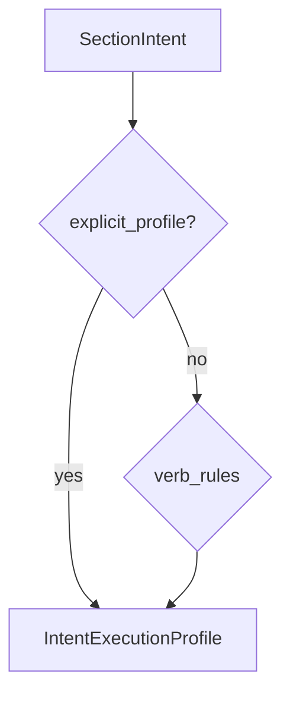
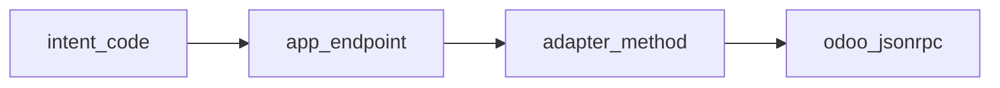

# Intent catalog & profiles — Diagrams

**Related:** [SRD](./SRD.md) · [TSD](./TSD.md) · [conops](./conops.md)

## Profile classifier

```mermaid
flowchart TD
  Intent[SectionIntent]
  Explicit{explicit_profile?}
  Verb{verb_rules}
  Out[IntentExecutionProfile]
  Intent --> Explicit
  Explicit -->|yes| Out
  Explicit -->|no| Verb
  Verb --> Out
```

## Call path (UI)

```mermaid
flowchart LR
  A[intent_code]
  B[app_endpoint]
  C[adapter_method]
  D[odoo_jsonrpc]
  A --> B --> C --> D
```
