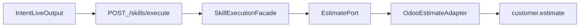
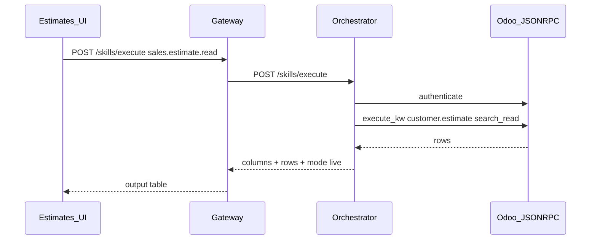

# Live estimate read — Diagrams

**Related:** [SRD](./SRD.md) · [TSD](./TSD.md) · [conops](./conops.md)

## Runtime

```mermaid
flowchart LR
  UI[IntentLiveOutput]
  Gw[POST_/skills/execute]
  Orch[SkillExecutionFacade]
  Port[EstimatePort]
  Ad[OdooEstimateAdapter]
  Od[customer.estimate]
  UI --> Gw --> Orch --> Port --> Ad --> Od
```

## Sequence

```mermaid
sequenceDiagram
  participant UI as Estimates_UI
  participant Gw as Gateway
  participant Orch as Orchestrator
  participant Od as Odoo_JSONRPC
  UI->>Gw: POST /skills/execute sales.estimate.read
  Gw->>Orch: POST /skills/execute
  Orch->>Od: authenticate
  Orch->>Od: execute_kw customer.estimate search_read
  Od-->>Orch: rows
  Orch-->>Gw: columns + rows + mode live
  Gw-->>UI: output table
```
