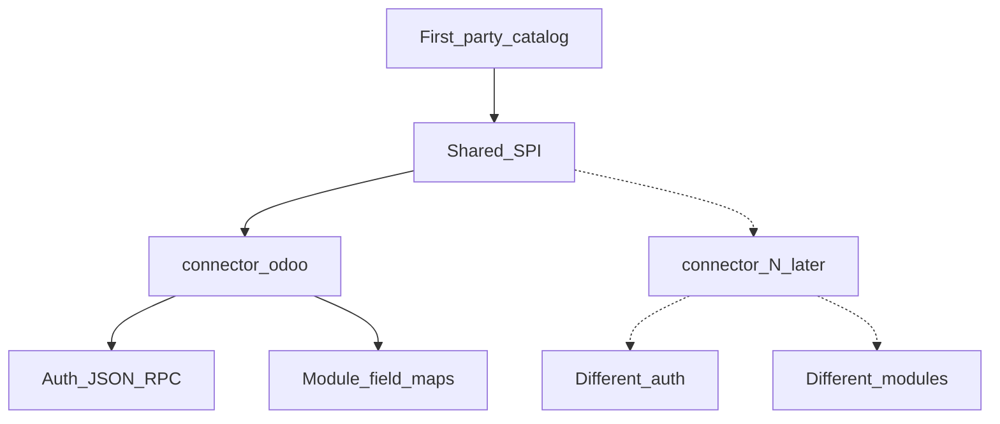

# Connector SPI & catalog — diagram

```mermaid
flowchart TB
  Catalog[First_party_catalog]
  SPI[Shared_SPI]
  Odoo[connector_odoo]
  Next[connector_N_later]

  Catalog --> SPI
  SPI --> Odoo
  SPI -.-> Next

  Odoo --> Auth1[Auth_JSON_RPC]
  Odoo --> Map1[Module_field_maps]
  Next -.-> AuthN[Different_auth]
  Next -.-> MapN[Different_modules]
```
