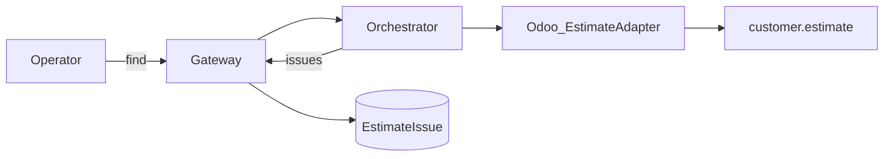

# Estimate issues find & persist — diagram

```mermaid
flowchart LR
  Op[Operator]
  GW[Gateway]
  ORCH[Orchestrator]
  AD[Odoo_EstimateAdapter]
  Od[customer.estimate]
  PG[(EstimateIssue)]

  Op -->|find| GW
  GW --> ORCH
  ORCH --> AD
  AD --> Od
  ORCH -->|issues| GW
  GW --> PG
```
