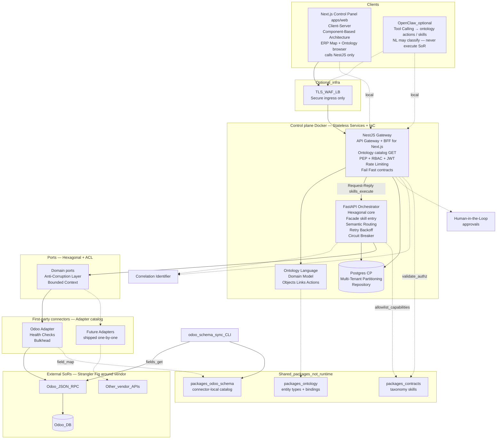
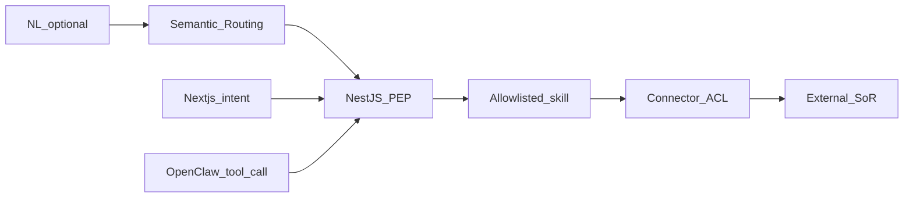
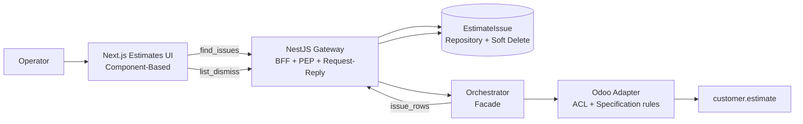
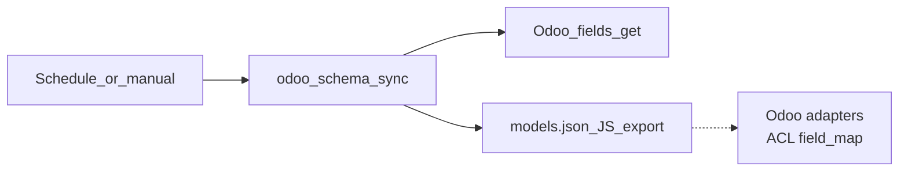

# Epic-06 — System design (component links + patterns)

Shows how clients, control-plane services, the **first-party connector catalog**, Postgres, and external SoRs connect. **Odoo is connector #1**; additional connectors plug the same ports when we ship them.

**Edge:** NestJS `apps/gateway` **is** the API Gateway — auth, tenancy, rate limits, contract validation. Do not add a second application gateway in front; optional TLS/WAF only. See [platform-concerns.md](../platform-concerns.md).

**Patterns:** curated map in [pattern-map.md](../pattern-map.md). **NL vs skills:** [governed-execution.md](../governed-execution.md). **Ontology Language:** [ontology.md](../ontology.md) / [Epic-07](../Epic-07/README.md).

## Pattern-annotated component map

## Pattern legend (by layer)

| Layer | Primary patterns |
|-------|------------------|
| **Next.js (`apps/web`)** | [Client-Server](../../Software%20Patterns%20Docs/Architectural%20Patterns/01-client-server.md), [Component-Based Architecture](../../Software%20Patterns%20Docs/Frontend_patterns/06-component-based-architecture.md), [Observer](../../Software%20Patterns%20Docs/Frontend_patterns/08-observer.md), [State Container](../../Software%20Patterns%20Docs/Frontend_patterns/09-state-container.md) (light), progressive disclosure (ERP map + intent rail + `/ontology`); **only** talks to NestJS BFF |
| Agents | [Tool Calling](../../Software%20Patterns%20Docs/AI_Agentic_patterns/03-tool-calling.md) — same gateway as Next.js; NL classifies only ([governed-execution](../governed-execution.md)) |
| Edge | Optional TLS only — **not** a second [API Gateway](../../Software%20Patterns%20Docs/Distributed_system_patterns/01-api-gateway.md) |
| NestJS gateway | [API Gateway](../../Software%20Patterns%20Docs/Distributed_system_patterns/01-api-gateway.md), [BFF](../../Software%20Patterns%20Docs/Architectural%20Patterns/21-backend-for-frontend-bff.md) **for Next.js**, [PEP](../../Software%20Patterns%20Docs/Security_patterns/16-policy-enforcement-point.md), [RBAC](../../Software%20Patterns%20Docs/Security_patterns/02-rbac.md), [JWT](../../Software%20Patterns%20Docs/Security_patterns/08-jwt.md), [Rate Limiting](../../Software%20Patterns%20Docs/Distributed_system_patterns/18-rate-limiting.md), [Fail Fast](../../Software%20Patterns%20Docs/Resilience_Pattern/05-fail-fast.md), [Human-in-the-Loop](../../Software%20Patterns%20Docs/AI_Agentic_patterns/09-human-in-the-loop.md) |
| **Ontology Language** | [Domain Model](../../Software%20Patterns%20Docs/Data_domain_patterns/14-domain-model.md), [Bounded Context](../../Software%20Patterns%20Docs/Org_System_Engineering_patterns/02-bounded-context.md), [Semantic Routing](../../Software%20Patterns%20Docs/AI_Agentic_patterns/12-semantic-routing.md) — actions → skills ([ontology](../ontology.md)) |
| Orchestrator | [Hexagonal](../../Software%20Patterns%20Docs/Architectural%20Patterns/05-hexagonal-architecture.md), [Facade](../../Software%20Patterns%20Docs/Structural%20Patterns/Facade.md), [Semantic Routing](../../Software%20Patterns%20Docs/AI_Agentic_patterns/12-semantic-routing.md), [Retry with Backoff](../../Software%20Patterns%20Docs/Distributed_system_patterns/04-retry-with-backoff.md), [Circuit Breaker](../../Software%20Patterns%20Docs/Distributed_system_patterns/02-circuit-breaker.md), [Timeout](../../Software%20Patterns%20Docs/Resilience_Pattern/03-timeout.md), [Idempotency](../../Software%20Patterns%20Docs/Distributed_system_patterns/20-idempotency.md) |
| Ports / connectors | [Anti-Corruption Layer](../../Software%20Patterns%20Docs/Distributed_system_patterns/15-anti-corruption-layer.md), [Adapter](../../Software%20Patterns%20Docs/Structural%20Patterns/Adapter.md), [Bounded Context](../../Software%20Patterns%20Docs/Org_System_Engineering_patterns/02-bounded-context.md), [Bulkhead](../../Software%20Patterns%20Docs/Distributed_system_patterns/05-bulkhead.md), [Health Checks](../../Software%20Patterns%20Docs/DevOps_Delivery_patterns/09-health-checks.md), [Fallback](../../Software%20Patterns%20Docs/Resilience_Pattern/07-fallback.md) (`simulate`) |
| Data | [Database per Service](../../Software%20Patterns%20Docs/Distributed_system_patterns/32-database-per-service.md), [Multi-Tenant Partitioning](../../Software%20Patterns%20Docs/Data_domain_patterns/21-multi-tenant-partitioning.md), [Repository](../../Software%20Patterns%20Docs/Data_domain_patterns/01-repository.md) |
| Cross-cutting | [Correlation Identifier](../../Software%20Patterns%20Docs/Messaging_Integration_patterns/19-correlation-identifier.md), [Observability](../../Software%20Patterns%20Docs/DevOps_Delivery_patterns/06-observability.md), [Defense in Depth](../../Software%20Patterns%20Docs/Security_patterns/09-defense-in-depth.md) |
| Around SoR | [Strangler Fig](../../Software%20Patterns%20Docs/Distributed_system_patterns/13-strangler-fig.md) — grow governed skills without replacing Odoo |

## Connector boundary

| Above (stable) | Below (per connector we ship) |
|----------------|-------------------------------|
| Taxonomy intents, ports, allowlist, evidence | Auth, transport, payloads, modules/fields |
| Capability matrix | Schema sync implementation |
| Tenant: enable connector + credentials | Health probe details |

Customers do not implement adapters. See [connectors.md](../connectors.md).

## NL / OpenClaw vs free-form execution

LLM may **route**; certified skills **execute**. Full rationale: [governed-execution.md](../governed-execution.md).

## Estimate issues path (Epic-06) — patterns

- UI: Next.js components only call the NestJS BFF ([Client-Server](../../Software%20Patterns%20Docs/Architectural%20Patterns/01-client-server.md))  
- Find: [Specification](../../Software%20Patterns%20Docs/Data_domain_patterns/07-specification.md) for issue rules inside ACL  
- Persist: [Repository](../../Software%20Patterns%20Docs/Data_domain_patterns/01-repository.md)  
- Dismiss: [Soft Delete](../../Software%20Patterns%20Docs/Data_domain_patterns/22-soft-delete.md) (control plane only)

## Schema catalog path (Odoo connector)

Other connectors will own their own schema-sync behind the same catalog idea when we ship them.
