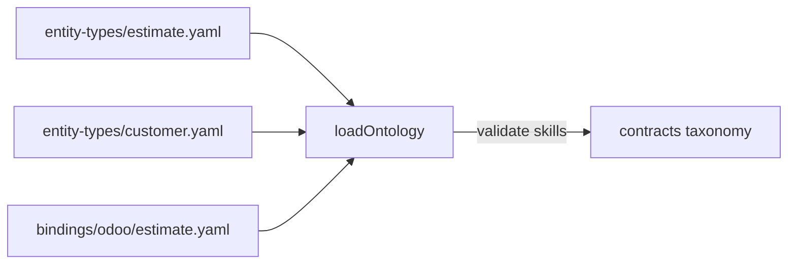

# Ontology package Estimate — diagram

```mermaid
flowchart LR
  Est[entity-types/estimate.yaml]
  Cust[entity-types/customer.yaml]
  Bind[bindings/odoo/estimate.yaml]
  Load[loadOntology]
  Tax[contracts taxonomy]
  Est --> Load
  Cust --> Load
  Bind --> Load
  Load -->|validate skills| Tax
```
