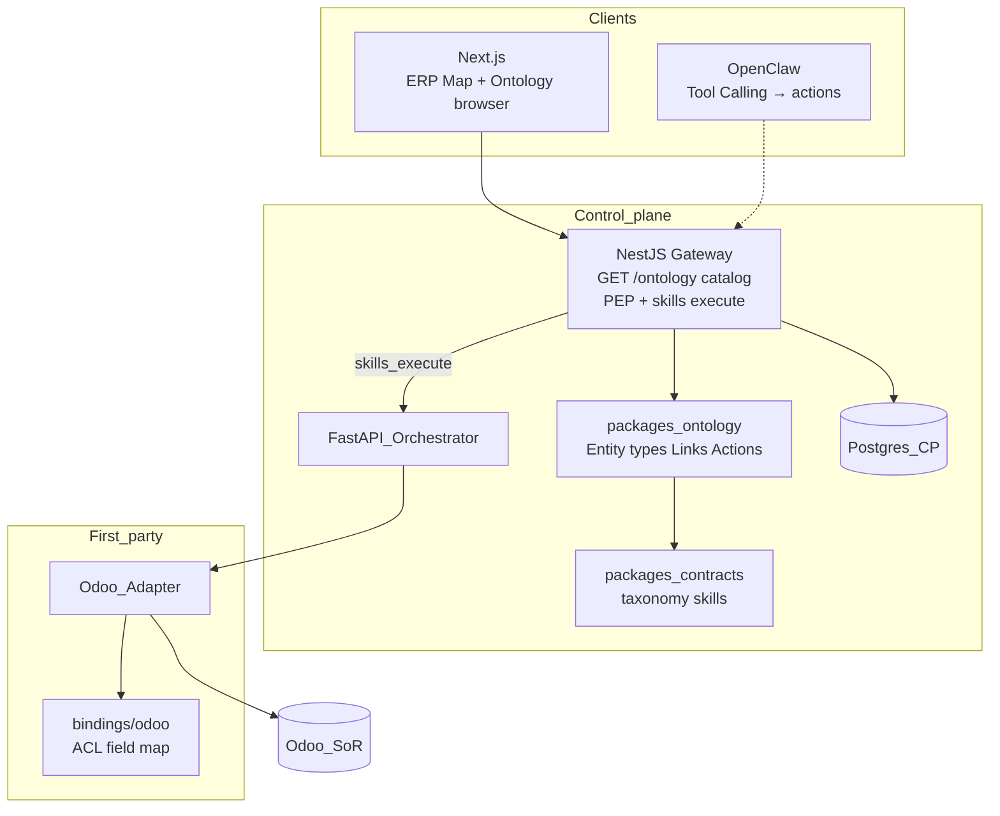

# Epic-07 — System design (Ontology Language)

Ontology sits between NestJS gateway and allowlisted skills. Connectors and SoRs unchanged. See [ontology.md](../ontology.md).

## Estimate object (v1 seed)

| Piece | Value |
|-------|--------|
| Entity type | `Estimate` |
| Action `read` | skill `sales.estimate.read` |
| Action `find_issues` | skill `sales.estimate.find_issues` (Epic-06; catalogued, execute when allowlisted) |
| Binding | `bindings/odoo/estimate.yaml` → `customer.estimate` fields inside ACL only |
