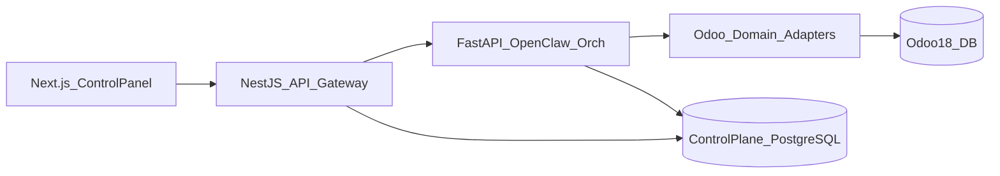

# Architecture overview

Standalone control plane in front of Odoo 18. Odoo stays the system of record; automation and OpenClaw orchestration stay outside Odoo.

## Layers

| Layer | Implementation (planned) |
|-------|--------------------------|
| Control panel UI | Next.js — `apps/web` |
| API gateway | NestJS — `apps/gateway` |
| OpenClaw orchestration | FastAPI — `apps/orchestrator` |
| Odoo domain adapters | Called only from orchestrator |
| Observability / knowledge | Logs, incidents, runbooks in control-plane DB |

## System context

## Data

- **Control-plane PostgreSQL:** users, roles, tasks, audits, incidents, runbooks, policies, connector config metadata.
- **Odoo DB:** ERP master and transactional data — never shared as the control-plane store.

## Hosting

Docker Compose locally and on Linux later. See [Deployment/Docker](../Deployment/Docker/README.md).

## Related

- [request-lifecycle](./request-lifecycle.md)
- [Components](../Components/README.md)
