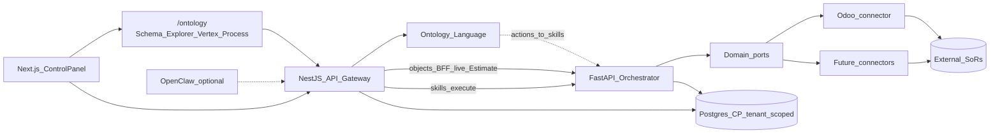

# Architecture overview

Standalone **control plane** for governed intents and skills across external systems. External systems stay systems of record; automation, approvals, evidence, and agent orchestration stay in the control plane.

**Odoo is connector #1**, not the product. Additional connectors ship **one by one**, owned and standardized by the product team — customers configure credentials and enable skills; they do not build adapters or define payloads.

**Ontology Language** maps the business (entity types, links, actions) above skills and connectors — see [ontology.md](./ontology.md). The `/ontology` UI exposes **Schema (Manager)**, **Explorer**, **Vertex**, and a curated **Process map** ([Gaps 04–06](../GAPS/README.md)).

## Layers

| Layer | Implementation |
|-------|----------------|
| **Control panel UI** | **Next.js** — `apps/web` (ERP Map + `/ontology` Schema / Explorer / Vertex / Process map; talks only to NestJS) |
| **API gateway (BFF)** | NestJS — `apps/gateway` — sole app entry; auth, ontology catalog + objects BFF, skills execute |
| **Ontology Language** | `packages/ontology` — entity types, properties, links, actions → skills |
| Orchestration | FastAPI — `apps/orchestrator` — internal; retries/circuits toward connectors |
| Domain ports + first-party connectors | Called only from orchestrator (ACL / Adapter) |
| Observability / knowledge | Structured logs, incidents, runbooks in control-plane DB |
| Runtime | Docker Compose: `postgres` (+ profile `apps`: `web`, `gateway`, `orchestrator`) |

## Edge decision

**NestJS is enough** as the API Gateway pattern for the control plane. Do **not** place a second application gateway between clients and NestJS. An optional infra proxy (TLS/WAF/load balancer) may sit in front in production; it is not a duplicate business gateway.

Clients → (optional TLS/WAF) → **NestJS** → Ontology catalog / objects BFF / skills → Orchestrator → Connectors → SoRs.

Details: [platform-concerns.md](./platform-concerns.md).

## System context

## Ontology surfaces (UI)

| Tab | Role | Backend |
|-----|------|---------|
| **Schema** | Ontology Manager — type catalog + inspector | `GET /ontology`, `GET /ontology/entity-types/:id` |
| **Explorer** | Object list/search + property layout | `GET /ontology/objects` → live `sales.estimate.read` or demo stubs |
| **Vertex** | Seed type + Search Around + local templates | Catalog links only (type-level) |
| **Process map** | Curated Estimate→…→Shipping spine | Curated edges (not every YAML link) |

Full Engine / instance twin remains [Gap 01](../GAPS/01-full-graph-engine.md).

## Cross-cutting (designed)

| Concern | Doc | Status |
|---------|-----|--------|
| Auth / RBAC | [platform-concerns](./platform-concerns.md#auth) | Designed (Epic-01 P02); runtime still dev-actor |
| Multi-tenant | [platform-concerns](./platform-concerns.md#multi-tenant) | Designed; not implemented |
| Logging | [platform-concerns](./platform-concerns.md#logging-system) | Epic-03 baseline; extend tenant/connector fields |
| Retry / circuit | [platform-concerns](./platform-concerns.md#try--retry-and-circuit-breaker) | Partial on Odoo client; standardize per connector |
| Docker | [docker-compose-strategy](../Deployment/Docker/docker-compose-strategy.md) | Local/Linux Compose; harden for prod; gateway image includes `packages/ontology` |
| Connectors | [connectors](./connectors.md) | Odoo shipping; catalog first-party |
| Ontology | [ontology](./ontology.md) | Language + catalog API + Schema/Explorer/Vertex/Process UI (Epic-07 + Gaps 04–06 slices) |

## Product boundary

| Stable (product-owned) | Per connector (product-owned, shipped one-by-one) |
|------------------------|--------------------------------------------------|
| Ontology entity types, links, actions | Auth scheme, API transport, vendor payloads |
| Taxonomy intents / skill codes | Module/model maps, field maps, pagination |
| Domain ports + contracts | Health probe, schema sync, simulate fixtures |
| Allowlist, dry-run, evidence, approvals | Connector config UI + secrets |
| Capability matrix | Vendor-specific retry/circuit tuning |
| Auth, tenant isolation, logging envelope | Binding YAML for that connector |
| Ontology schema catalog + curated process views | Live object reads only via allowlisted skills |

Customers never implement the connector SPI or ontology Language in v1. New systems appear only when **we** ship a first-party connector.

**Agents / NL:** OpenClaw is an optional gateway client. Natural language may classify to an intent/action; it must not free-form call SoRs. See [governed-execution](./governed-execution.md).

## Data

- **Control-plane PostgreSQL:** users, roles, **tenants**, tasks, audits, incidents, runbooks, policies, **connector config metadata**, capability bindings — tenant-scoped.
- **Ontology Language:** versioned YAML in `packages/ontology` (not a mirrored SoR).
- **Object Explorer:** live rows from SoR via allowlisted skills (Estimate today); demo stubs otherwise — not a control-plane instance store.
- **External SoR DBs / APIs:** master and transactional data — never the control-plane store. Odoo DB is one SoR among others.

## Hosting

Docker Compose locally and on Linux later. See [Deployment/Docker](../Deployment/Docker/README.md). Default Compose starts **Postgres**; profile `apps` builds **web + gateway + orchestrator**. External SoRs (including Odoo) stay outside the control-plane Compose stack unless explicitly decided otherwise. Publish **web + gateway** (and TLS proxy if used); keep orchestrator private.

## Related

- [ontology](./ontology.md) — Ontology Language + UI surfaces
- [GAPS](../GAPS/README.md) — Engine, ownership, visual exploration gaps
- [governed-execution](./governed-execution.md) — NL routes; skills execute
- [pattern-map](./pattern-map.md) — Software Patterns Docs ↔ this design
- [platform-concerns](./platform-concerns.md) — auth, tenancy, logging, retry, Docker, edge
- [connectors](./connectors.md) — first-party connector catalog and SPI
- [request-lifecycle](./request-lifecycle.md)
- [reliability-rules](./reliability-rules.md)
- [Components](../Components/README.md)
