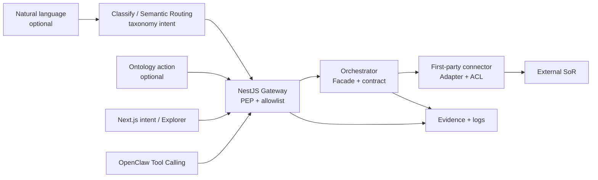

# Governed execution (why not free-form NL)

ERP and multi-system actions are **high-blast-radius**. Free-form LLM tool use is **unbounded**. This control plane turns “whatever the user said” into a **closed, checkable operation**.

**Rule of thumb:** the LLM may *propose* or *route*; only **certified skills** may *execute*.

Ontology actions are **labels for those skills** — not a second execution path. Clicking an action in Schema / Explorer still runs the allowlisted skill (or does nothing until certified).

## What goes wrong if the LLM just does what NL says

| Risk | Free-form NL → vendor APIs | Orchestrated path (this product) |
|------|----------------------------|----------------------------------|
| Wrong write | Invents fields, models, or deletes the wrong record | Allowlisted skill + typed contract |
| No dry-run | Talks itself into a live commit | Dry-run / simulate first |
| No audit | “The model said so” | Correlation id, evidence, actor, tenant |
| Prompt injection | Email/ticket text hijacks tools | Skills only; NL cannot invent new tools |
| Drift | Same sentence → different API calls tomorrow | Same intent → same skill path |
| Multi-system | Each connector’s quirks leak into prompts | ACL + first-party adapters we own |
| Approvals / SoD | Model skips humans | Human-in-the-Loop by policy |

Natural language is great for **expressing intent**. It is a bad **execution engine** for money, inventory, and customer records.

## What we standardize (not “kill the LLM”)

Put the model in the right layer:

1. **NL (optional)** → classify to a taxonomy intent (e.g. `sales.estimate.read`), or operator picks Ontology action / Explorer type  
2. **Gateway / orchestrator** → allowlisted skill, validate contract, resolve connector + tenant  
3. **Adapter** → speak Odoo / future SoRs safely  
4. **Evidence + logs** → prove what ran  

OpenClaw is a **client of the same gateway** as Next.js — not a free agent holding SoR keys.

**Explorer:** `GET /ontology/objects` may call the live skill only when allowlisted (Estimate today); otherwise returns **demo** rows — never invents a new execute path.

## Product reason

Clients do not buy “chat that can touch Odoo.” They buy **governed automation**: predictable, approvable, retryable, multi-tenant, multi-connector. Standardization is what lets us ship connectors one-by-one and still look like one product. Ontology makes the business map legible without relaxing the allowlist.

## Patterns

- [Semantic Routing](../Software%20Patterns%20Docs/AI_Agentic_patterns/12-semantic-routing.md) — NL/UI/Ontology action → intent  
- [Tool Calling](../Software%20Patterns%20Docs/AI_Agentic_patterns/03-tool-calling.md) — agents call **skills**, not raw vendor APIs  
- [Human-in-the-Loop](../Software%20Patterns%20Docs/AI_Agentic_patterns/09-human-in-the-loop.md) — approvals before commit  
- [Fail Fast](../Software%20Patterns%20Docs/Resilience_Pattern/05-fail-fast.md) — reject unknown intents/skills  
- [Policy Enforcement Point](../Software%20Patterns%20Docs/Security_patterns/16-policy-enforcement-point.md) — gateway gates execution  
- [Anti-Corruption Layer](../Software%20Patterns%20Docs/Distributed_system_patterns/15-anti-corruption-layer.md) — vendor payloads stay in adapters  

See also [reliability-rules](./reliability-rules.md), [request-lifecycle](./request-lifecycle.md), [connectors](./connectors.md), [ontology](./ontology.md).
