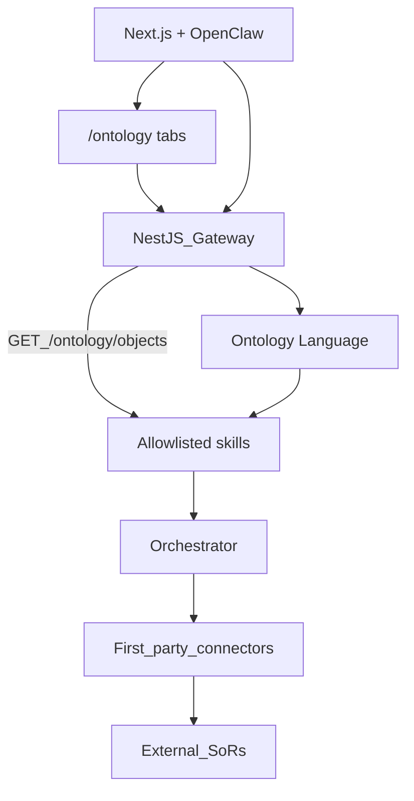
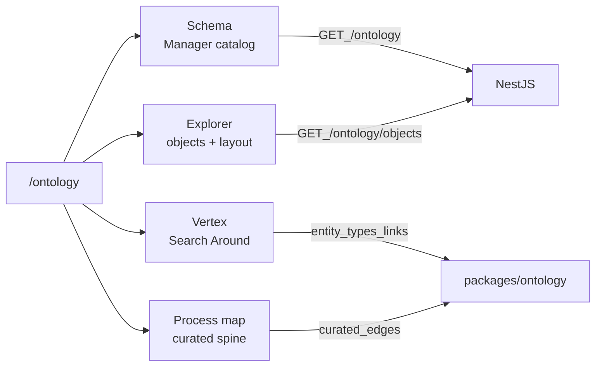

# Ontology Language

Business map for the control plane — inspired by [Palantir Ontology](https://www.palantir.com/docs/foundry/architecture-center/ontology-system/) (Data · Logic · Action · Security) and [Microsoft Fabric IQ Ontology](https://learn.microsoft.com/en-us/fabric/iq/ontology/overview) (entity types, properties, relationships, bindings).

Ontology does **not** replace connectors, contracts, or governed skills. It is the shared **nouns + allowed verbs** layer that humans and agents use instead of vendor models.

## Four pillars (v1)

| Pillar | Meaning here |
|--------|----------------|
| **Data** | Entity types, properties, links (YAML Language) |
| **Logic** | Named specs referenced by actions (e.g. estimate-issue rules) |
| **Action** | Object actions bound to taxonomy skills (`sales.estimate.read`) |
| **Security** | Actions inherit skill allowlist + future RBAC/PEP |

## Placement

- Ontology = business map  
- Skills = certified execution ([governed-execution](./governed-execution.md))  
- Connectors = vendor bindings ([connectors](./connectors.md))  
- SoRs stay authoritative — Ontology is **not** a second SoR  

## Primitives

| Concept | Package artifact |
|---------|------------------|
| Entity type | `packages/ontology/entity-types/*.yaml` |
| Properties | Typed domain fields (not Odoo columns) |
| Links | Declared relationships (metadata in v1) |
| Actions | `skill:` → taxonomy intent code |
| Binding | `packages/ontology/bindings/<connector>/*.yaml` — ACL-side only |

## Ownership

| Actor | Owns |
|-------|------|
| Product | Ontology Language, entity catalog, action→skill map, curated process/Vertex views |
| Connector owner | Bindings for that connector |
| Customer | Credentials + which connectors/skills to enable — **not** ontology authoring in v1 |

## Browser UI (`/ontology`)

Layout follows Palantir-inspired **exploration + curated views** — not one algorithm that auto-arranges every type into a process spine. See [GAPS visual logic](../GAPS/README.md).

| Tab | What it is | Notes |
|-----|------------|--------|
| **Schema** | Ontology Manager — searchable types, props, links, actions, icons | Read-only; YAML remains source of truth ([Gap 04](../GAPS/04-ontology-manager-schema.md)) |
| **Explorer** | Object search/list + property layout; save exploration locally | Estimate → live skill; other types → demo ([Gap 05](../GAPS/05-object-explorer-instances.md)) |
| **Vertex** | Seed type → Search Around along schema links; save templates locally | Type-level; instance graphs wait on Gap 01 ([Gap 06](../GAPS/06-vertex-graph-exploration.md)) |
| **Process map** | Fixed business spine (Estimate → Quote → Sales → Inventory → Manufacturing → Shipping; SO → PO → Receiving) | Curated edges only — avoids spaghetti |

Gateway APIs:

| Method | Path | Use |
|--------|------|-----|
| `GET` | `/ontology` | Entity-type catalog |
| `GET` | `/ontology/entity-types/:id` | One type detail |
| `GET` | `/ontology/objects?entity_type=&q=&limit=` | Explorer BFF (live or demo) |

See [OntologyDocs](../Components/OntologyDocs/README.md).

## How to modify the Language (v1)

Ontology is **product-owned** — change it in the repo, not via customer self-serve:

| Change | What to do |
|--------|------------|
| Add entity | New file in `packages/ontology/entity-types/*.yaml` |
| Add / remove property or link | Edit that entity YAML |
| Add action | Add under `actions:` with `skill:` already in contracts taxonomy |
| Remove entity | Delete YAML (+ binding if any) |
| Connector field map | `packages/ontology/bindings/<connector_id>/*.yaml` |
| Verify | `npm test -w @control-panel-erp/ontology` then reload gateway |
| Process / Vertex UX | UI curated edges / Search Around — Language YAML still owns links |

In-browser CRUD (DB-backed Ontology Engine) is **out of scope for v1**; the catalog API shape stays valid when that lands.

## Anti-goals (v1)

Tracked as explicit gaps under [docs/GAPS](../GAPS/README.md):

- Full instance graph / digital-twin store / CDC — [Gap 01](../GAPS/01-full-graph-engine.md)
- Epic-06 estimate-issues **execution** (skill catalogued, runtime pending) — [Gap 02](../GAPS/02-epic-06-estimate-issues-execution.md)
- Customer-built ontology SDK or marketplace — [Gap 03](../GAPS/03-customer-authored-ontology.md)
- Full Manager authoring / publish gates — [Gap 04](../GAPS/04-ontology-manager-schema.md) (read-only Schema shipped)
- Full Object Explorer (cross-type index, server layouts) — [Gap 05](../GAPS/05-object-explorer-instances.md) (Estimate live + demos shipped)
- Instance Vertex / simulation — [Gap 06](../GAPS/06-vertex-graph-exploration.md) (type-level Search Around shipped)
- Geospatial maps / Workshop-Quiver builders — [Gaps 07–08](../GAPS/README.md)
- NL free-form writes “because ontology exists”
- Replacing `packages/contracts` or the connector SPI
- Fabric OneLake / Palantir Foundry dependency

## Patterns

- [Domain Model](../Software%20Patterns%20Docs/Data_domain_patterns/14-domain-model.md)  
- [Bounded Context](../Software%20Patterns%20Docs/Org_System_Engineering_patterns/02-bounded-context.md)  
- [Anti-Corruption Layer](../Software%20Patterns%20Docs/Distributed_system_patterns/15-anti-corruption-layer.md)  
- [Semantic Routing](../Software%20Patterns%20Docs/AI_Agentic_patterns/12-semantic-routing.md)  
- [Backend-for-Frontend](../Software%20Patterns%20Docs/Architectural%20Patterns/21-backend-for-frontend-bff.md) — `/ontology/objects`  
- [Component-Based Architecture](../Software%20Patterns%20Docs/Frontend_patterns/06-component-based-architecture.md) — Manager / Explorer / Vertex  

## Related

- [Epic-07](./Epic-07/README.md)  
- [Components/OntologyDocs](../Components/OntologyDocs/README.md)  
- [architecture-overview](./architecture-overview.md)  
- [GAPS](../GAPS/README.md)  
