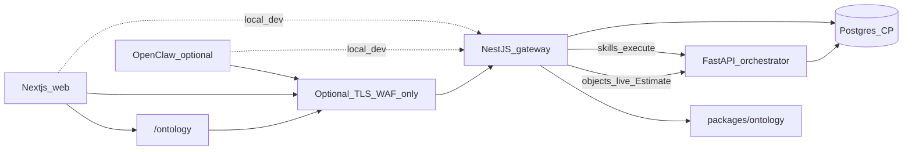
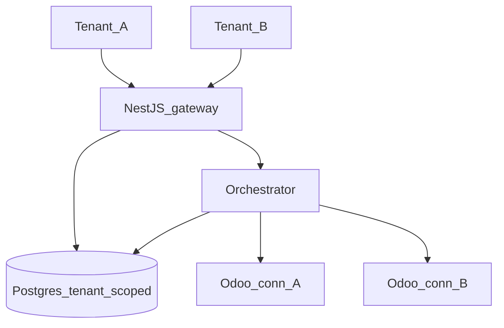

# Platform concerns (auth, tenancy, logging, retry, Docker, edge)

Cross-cutting requirements for the control plane. Connector catalog stays in [connectors.md](./connectors.md). Ontology Language + UI in [ontology.md](./ontology.md). Patterns cited from Software Patterns Docs — full mapping in [pattern-map.md](./pattern-map.md).

## Edge: NestJS is the API gateway — do not add another by default

**Decision:** `apps/gateway` (NestJS) **is** the control-plane API Gateway / BFF. Clients (Next.js web, future OpenClaw) call NestJS only. NestJS authenticates, authorizes, rate-limits, validates contracts, serves ontology catalog/objects, writes audits, and calls the orchestrator.

| Option | When |
|--------|------|
| **NestJS only (default)** | One public HTTP entry to the control plane; web + agents share intents API |
| **Extra edge proxy** (Traefik / nginx / Cloudflare / Azure APIM / Kong) | TLS termination, WAF, multi-env routing, partner public API at scale — **infra**, not a second app gateway |
| **Second application gateway** in front of NestJS | **Avoid** until NestJS cannot own auth/routing; duplicates the [API Gateway](../Software%20Patterns%20Docs/Distributed_system_patterns/01-api-gateway.md) pattern |

Gateway ontology routes (BFF):

| Path | Role |
|------|------|
| `GET /ontology` | Entity-type catalog |
| `GET /ontology/entity-types/:id` | Type detail |
| `GET /ontology/objects` | Explorer — live allowlisted skill or demo stubs |
| `POST /skills/execute` | Certified skill execution (unchanged) |

Orchestrator stays **internal** (Compose network / private URL). Browser and agents never call orchestrator or connector APIs directly.

---

## Auth

**Status:** Epic-01 Phase 02 designed; runtime still **dev-actor** (`X-Actor-Id`). Must land before multi-tenant production.

| Concern | Design |
|---------|--------|
| Identity | Users in control-plane Postgres; sessions or JWT issued by NestJS |
| Authorization | RBAC + skill allowlist + connector capability matrix |
| SoD | Approvals for production writes by threshold ([reliability-rules](./reliability-rules.md)) |
| Agents | Service principals / API keys scoped per tenant; same gateway authn/z |
| Connector secrets | Per-tenant connector credentials; write-only in UI; never in shared packages |
| Ontology | Catalog is product Language (not tenant-authored); live objects inherit skill authz |

Patterns: JWT / session auth (Security patterns), RBAC, audit on every skill execution.

**Non-goal now:** customers bringing IdP plugins into the connector SPI. SSO (OIDC/SAML) is a control-plane concern on NestJS.

---

## Multi-tenant

**Status:** not implemented; required for product packaging.

| Concern | Design |
|---------|--------|
| Tenant | `tenant_id` on users, tasks, issues, connector configs, allowlists |
| Isolation | Row-level tenant filter in gateway/orchestrator queries; no shared connector secrets across tenants |
| Connectors | Tenant **enables** first-party connectors we ship; config is per tenant |
| Capabilities | Allowlist ∩ connector capabilities ∩ tenant entitlements |
| Ontology | Shared product Language; per-tenant enablement of skills/connectors only |
| Data | One control-plane DB with tenant columns first; schema-per-tenant only if compliance demands it later |

---

## Logging system

**Status:** Epic-03 structured logging + correlation + console — **done** as baseline; extend for tenant and auth.

| Concern | Design |
|---------|--------|
| Structure | JSON logs with `correlation_id`, `tenant_id`, `actor_id`, `intent_code`, `connector_id` |
| Correlation | [Correlation Identifier](../Software%20Patterns%20Docs/Messaging_Integration_patterns/19-correlation-identifier.md) gateway → orchestrator → connector |
| Product UI | `/logs` and request console (Epic-03); Explorer/skills share correlation |
| Evidence | Skill evidence under `STORAGE_ROOT` + DB task/issue rows ([Observability](../Software%20Patterns%20Docs/DevOps_Delivery_patterns/06-observability.md)) |
| Retention | Control-plane policy; no PII in log bodies beyond what audit requires |

Do **not** put a log stack inside `packages/*`. Logging is an **app** concern (gateway + orchestrator). Optional later: ship logs to Loki/ELK — external to shared packages.

---

## Try / retry (and circuit breaker)

Apply on **outbound** calls (orchestrator → connector → vendor API), not on every user click blindly.

| Concern | Design |
|---------|--------|
| Retry | [Retry with Backoff](../Software%20Patterns%20Docs/Distributed_system_patterns/04-retry-with-backoff.md) + jitter for transient faults (timeouts, 429, connection reset) |
| Limits | Cap attempts; never retry non-idempotent commits without idempotency key |
| Circuit | [Circuit Breaker](../Software%20Patterns%20Docs/Distributed_system_patterns/02-circuit-breaker.md) per connector instance when vendor is down |
| Dry-run / simulate | No vendor retry storms in simulate; deterministic fixtures |
| Explorer | Live Estimate path uses same orchestrator execute + retry policy; demo stubs do not call SoR |
| User-facing | Gateway returns structured error; incident record on repeated failure ([learning-loop](./learning-loop.md)) |

Idempotency for writes: skill execution id / idempotency key stored in control-plane before commit.

---

## Docker containers

**Status:** Compose strategy exists; harden for multi-tenant prod later.

| Service | Image / role |
|---------|----------------|
| `web` | Next.js control panel (includes `/ontology` tabs) |
| `gateway` | NestJS API gateway — **must bake `packages/ontology` + contracts** |
| `orchestrator` | FastAPI + connector adapters |
| `postgres` | Control-plane DB (default Compose service) |
| External | Odoo and other SoRs — **not** in Compose by default |

Default: `docker compose up -d` → Postgres only. Apps: `docker compose --profile apps up --build -d`.

See [docker-compose-strategy](../Deployment/Docker/docker-compose-strategy.md) and [monorepo-layout](./monorepo-layout.md).

Hardening checklist: non-root users, healthchecks, resource limits, secrets via files/secret manager, private network for orchestrator, only gateway (+ web) published.

**Redis:** not required for shared packages; add as a Compose service only when gateway/orchestrator need shared rate-limit/queue state across replicas.

---

## Implementation sequencing (design → build)

| Order | Concern | Notes |
|-------|---------|--------|
| 1 | Keep NestJS as sole app gateway | Optional TLS proxy only |
| 2 | Auth + RBAC replace `X-Actor-Id` | Blocks real multi-tenant |
| 3 | `tenant_id` on CP models + connector config | Product packaging |
| 4 | Logging fields tenant/actor/connector | Extend Epic-03 |
| 5 | Retry/backoff + circuit on connectors | Orchestrator adapters |
| 6 | Docker hardening + publish only edge ports | Linux/prod; ontology package in gateway image |
| 7 | Ontology Engine / instance graph | [Gap 01](../GAPS/01-full-graph-engine.md) — after Language + Explorer slices |

Epic-06 estimate-issues can continue with dev-actor, but **auth + tenant** should be scheduled before selling multi-customer access.
