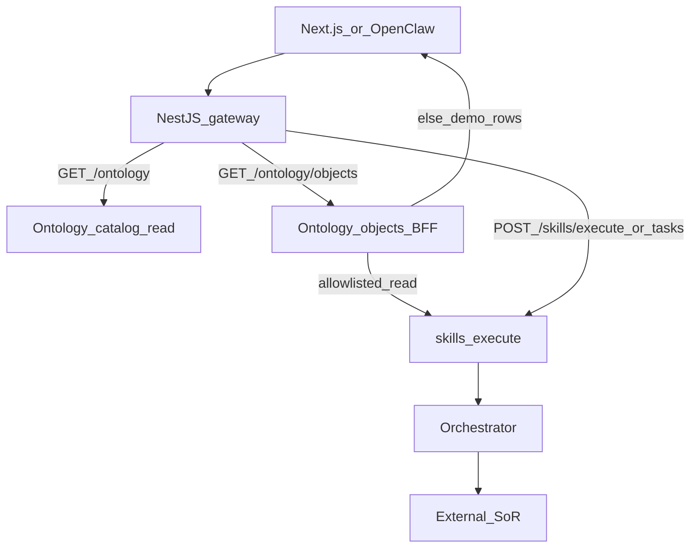

# Request lifecycle

Every action (operator or agent) is a controlled business operation. Entry is always the NestJS gateway ([platform-concerns](./platform-concerns.md)). Why NL is not the executor: [governed-execution](./governed-execution.md). Ontology catalog vs execute: [ontology](./ontology.md).

## Paths

## Execute / task path (skills)

1. Request hits NestJS (optional TLS/WAF in front only) — from **Next.js** (intent click, Explorer live Estimate, Ontology action link) or **OpenClaw** (tool call), never direct to SoR  
2. Authenticate + authorize (RBAC; replace `X-Actor-Id` for production)  
3. Resolve tenant; enforce isolation  
4. Intent classified (taxonomy code) or resolved via Ontology action → skill  
5. Contract validated  
6. Skill selected (allowlist ∩ tenant entitlements)  
7. Connector resolved (tenant-enabled + capability matrix)  
8. Dry-run or simulation  
9. Approval if needed (**Human-in-the-Loop**)  
10. Execution via domain port → first-party connector adapter (retry/backoff + circuit on vendor calls)  
11. Verification  
12. Structured log + audit persisted (`correlation_id`, `tenant_id`, `actor_id`, `connector_id`)  
13. Incident / resolution knowledge updated  

## Ontology catalog path (read-only Language)

1. `GET /ontology` or `GET /ontology/entity-types/:id`  
2. Auth (dev-actor today)  
3. Load product-owned YAML via `packages/ontology`  
4. Return catalog JSON — **no SoR call**  

## Object Explorer path

1. `GET /ontology/objects?entity_type=&q=`  
2. Resolve entity type + read action skill  
3. If skill on live execute allowlist → same orchestrator execute path as skills (Estimate today)  
4. Else → demo objects from schema properties (no SoR)  
5. UI may save exploration metadata in **browser localStorage** only  

Vertex Search Around and Process map stay **client-side over catalog links** (no instance Engine yet).

See also [reliability-rules](./reliability-rules.md), [connectors](./connectors.md), [ontology](./ontology.md), and [learning-loop](./learning-loop.md).
