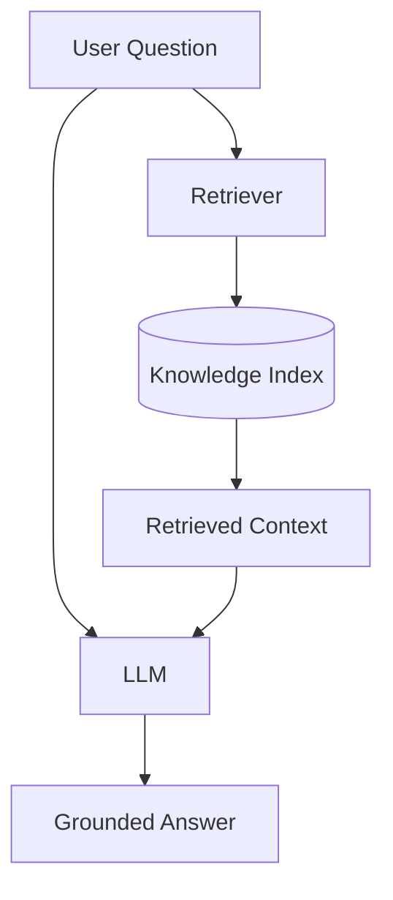
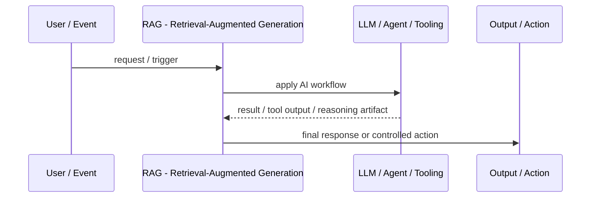
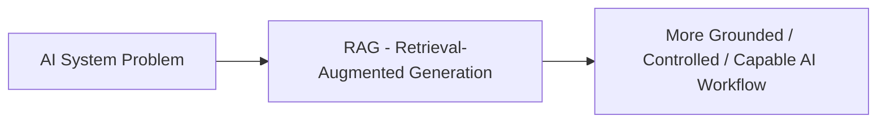

# RAG - Retrieval-Augmented Generation

## Core Idea

RAG combines retrieval from trusted knowledge sources with generation from an LLM so answers can be grounded in external context.

---

## Problem It Solves

An LLM needs to answer using private, current, or domain-specific knowledge that is not reliably stored in the model itself.

---

## 3 Concrete Examples

### Example 1: Internal Policy Assistant

The assistant retrieves HR and security policy chunks before answering employee questions.

### Example 2: Technical Support Bot

The system retrieves product docs, troubleshooting guides, and known issues before generating a support response.

### Example 3: Legal Contract Review Helper

The model retrieves clauses from uploaded contracts and answers questions using cited passages.

---

## Architect Questions

- What trusted knowledge sources should be retrieved?
- How will documents be chunked, indexed, and updated?
- What retrieval method is needed: keyword, vector, hybrid, or graph?
- How will the answer cite or reference sources?
- What happens when retrieval finds no reliable evidence?
- How will hallucination, stale data, and permission leakage be controlled?

---

## Main Diagram



---

## Runtime / Agentic Flow



---

## Implementation Shape

```txt
1. Identify the AI failure mode or capability gap: missing knowledge, weak planning, unsafe action, poor routing, lack of memory, or low verification.
2. Define the workflow boundary: prompt, retriever, tool, agent, supervisor, memory, router, or human approval gate.
3. Define input/output contracts for each step.
4. Define safety controls: permissions, citations, validation, confidence thresholds, fallback, and audit logs.
5. Define evaluation: accuracy, grounding, tool success rate, latency, cost, user satisfaction, and failure cases.
6. Add observability: prompts, retrieved context, tool calls, routing decisions, model outputs, and human overrides.
7. Keep the pattern focused. Do not add agents where a deterministic workflow or simple retrieval system is enough.
```

---

## When to Use

- Answers must use private, current, or domain-specific knowledge.
- Source grounding and citations matter.
- Knowledge changes faster than model training.

---

## When Not to Use

- No trusted knowledge source exists.
- Retrieval quality is poor and unmeasured.
- The task does not require external grounding.

---

## Common Smell That Suggests This Pattern

```txt
The AI system is hallucinating,
using stale knowledge,
choosing the wrong workflow,
taking unsafe actions,
losing task context,
or failing because one prompt is trying to do too much.
```

---

## Common Mistakes

```txt
Calling everything an agent.

Adding multiple agents when one workflow is enough.

Using RAG without measuring retrieval quality.

Letting tools run without authorization or confirmation.

Storing memory without consent, inspection, or deletion.

Routing semantically without fallback.

Evaluating only demos instead of failure cases.

Hiding uncertainty instead of exposing it clearly.
```

---

## Best Visual Summary



## Final Meaning

RAG - Retrieval-Augmented Generation is useful when it solves a real LLM or agent workflow problem. If a simpler deterministic design works, use that first.
