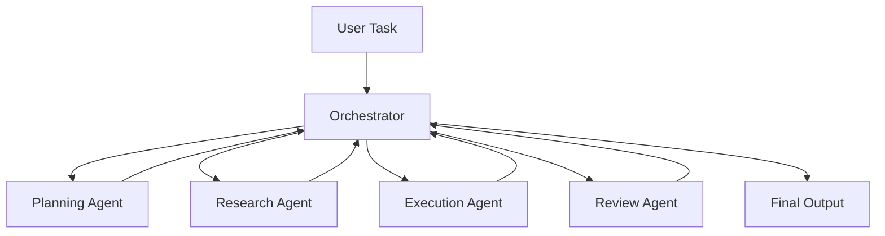
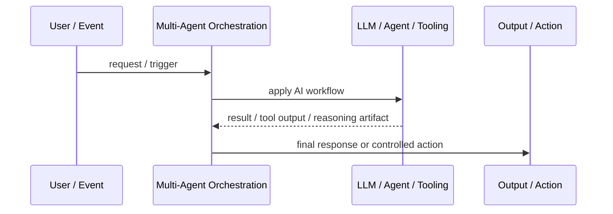
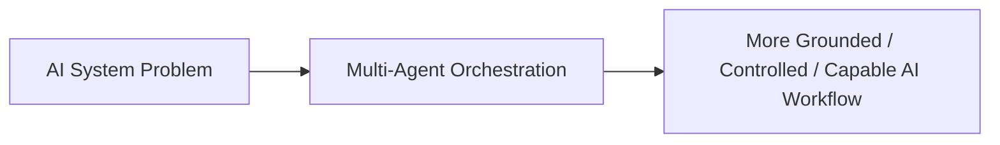

# Multi-Agent Orchestration

## Core Idea

Multi-Agent Orchestration coordinates multiple specialized agents to solve a task that benefits from role separation.

---

## Problem It Solves

One agent becomes too broad, brittle, or hard to control when a workflow needs planning, research, coding, review, testing, and decision-making.

---

## 3 Concrete Examples

### Example 1: Software Delivery Agents

Planner, developer, reviewer, tester, and documentation agents collaborate on a feature.

### Example 2: Research Workflow

Search agent gathers sources, analysis agent synthesizes, critique agent checks gaps, and writer agent drafts the report.

### Example 3: Operations Incident Response

Triage agent classifies incident, log agent investigates evidence, remediation agent proposes actions, and supervisor approves.

---

## Architect Questions

- What roles are actually needed?
- Who coordinates agent execution?
- How is state shared between agents?
- How are conflicting outputs resolved?
- Which agent can use which tools?
- Where are human approval gates required?

---

## Main Diagram



---

## Runtime / Agentic Flow



---

## Implementation Shape

```txt
1. Identify the AI failure mode or capability gap: missing knowledge, weak planning, unsafe action, poor routing, lack of memory, or low verification.
2. Define the workflow boundary: prompt, retriever, tool, agent, supervisor, memory, router, or human approval gate.
3. Define input/output contracts for each step.
4. Define safety controls: permissions, citations, validation, confidence thresholds, fallback, and audit logs.
5. Define evaluation: accuracy, grounding, tool success rate, latency, cost, user satisfaction, and failure cases.
6. Add observability: prompts, retrieved context, tool calls, routing decisions, model outputs, and human overrides.
7. Keep the pattern focused. Do not add agents where a deterministic workflow or simple retrieval system is enough.
```

---

## When to Use

- The workflow benefits from specialized roles.
- Tasks require planning, execution, review, and tool use.
- A supervisor can manage coordination and quality.

---

## When Not to Use

- One well-designed agent or workflow is enough.
- Coordination overhead exceeds value.
- Agents have unclear responsibilities.

---

## Common Smell That Suggests This Pattern

```txt
The AI system is hallucinating,
using stale knowledge,
choosing the wrong workflow,
taking unsafe actions,
losing task context,
or failing because one prompt is trying to do too much.
```

---

## Common Mistakes

```txt
Calling everything an agent.

Adding multiple agents when one workflow is enough.

Using RAG without measuring retrieval quality.

Letting tools run without authorization or confirmation.

Storing memory without consent, inspection, or deletion.

Routing semantically without fallback.

Evaluating only demos instead of failure cases.

Hiding uncertainty instead of exposing it clearly.
```

---

## Best Visual Summary



## Final Meaning

Multi-Agent Orchestration is useful when it solves a real LLM or agent workflow problem. If a simpler deterministic design works, use that first.
