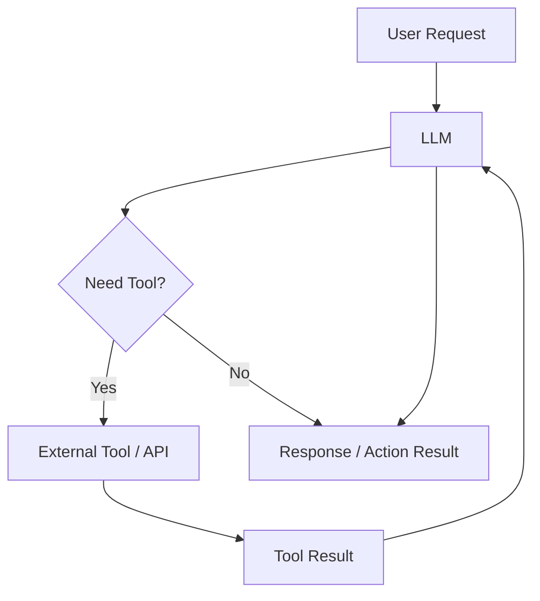
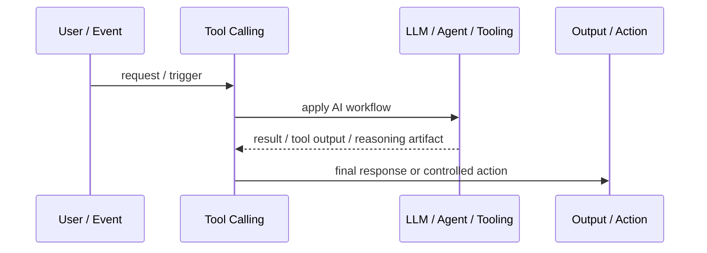
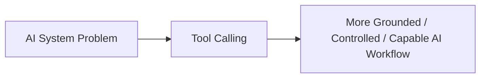

# Tool Calling

## Core Idea

Tool Calling lets an LLM invoke external functions, APIs, databases, calculators, or workflows to perform actions or retrieve exact information.

---

## Problem It Solves

The model alone cannot reliably calculate, fetch live data, modify systems, search private sources, or execute deterministic operations.

---

## 3 Concrete Examples

### Example 1: Calendar Assistant

The model calls calendar tools to search availability and create events.

### Example 2: Data Analysis Agent

The model calls Python or SQL tools to compute statistics instead of guessing.

### Example 3: Customer Support Automation

The model calls CRM and ticketing APIs to look up orders and update case status.

---

## Architect Questions

- Which tools should the model be allowed to call?
- What schemas and parameter validation are required?
- Which actions need user confirmation?
- How are tool errors handled?
- How is authorization enforced?
- How are tool calls logged and audited?

---

## Main Diagram



---

## Runtime / Agentic Flow



---

## Implementation Shape

```txt
1. Identify the AI failure mode or capability gap: missing knowledge, weak planning, unsafe action, poor routing, lack of memory, or low verification.
2. Define the workflow boundary: prompt, retriever, tool, agent, supervisor, memory, router, or human approval gate.
3. Define input/output contracts for each step.
4. Define safety controls: permissions, citations, validation, confidence thresholds, fallback, and audit logs.
5. Define evaluation: accuracy, grounding, tool success rate, latency, cost, user satisfaction, and failure cases.
6. Add observability: prompts, retrieved context, tool calls, routing decisions, model outputs, and human overrides.
7. Keep the pattern focused. Do not add agents where a deterministic workflow or simple retrieval system is enough.
```

---

## When to Use

- The model needs external data or deterministic actions.
- APIs, databases, calculators, or workflows are available.
- Tool permissions and schemas can be controlled.

---

## When Not to Use

- The model can answer safely without external action.
- Tool schemas are vague or unsafe.
- Authorization and confirmation are not designed.

---

## Common Smell That Suggests This Pattern

```txt
The AI system is hallucinating,
using stale knowledge,
choosing the wrong workflow,
taking unsafe actions,
losing task context,
or failing because one prompt is trying to do too much.
```

---

## Common Mistakes

```txt
Calling everything an agent.

Adding multiple agents when one workflow is enough.

Using RAG without measuring retrieval quality.

Letting tools run without authorization or confirmation.

Storing memory without consent, inspection, or deletion.

Routing semantically without fallback.

Evaluating only demos instead of failure cases.

Hiding uncertainty instead of exposing it clearly.
```

---

## Best Visual Summary



## Final Meaning

Tool Calling is useful when it solves a real LLM or agent workflow problem. If a simpler deterministic design works, use that first.
