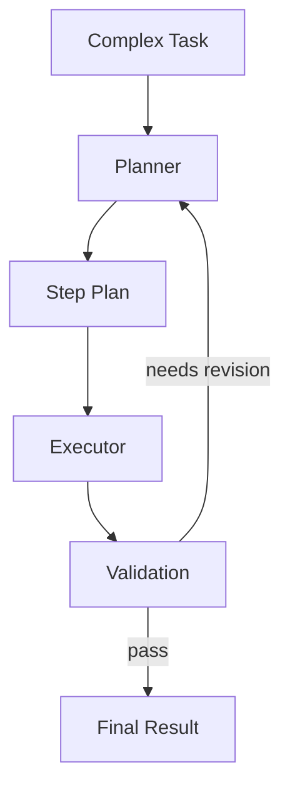
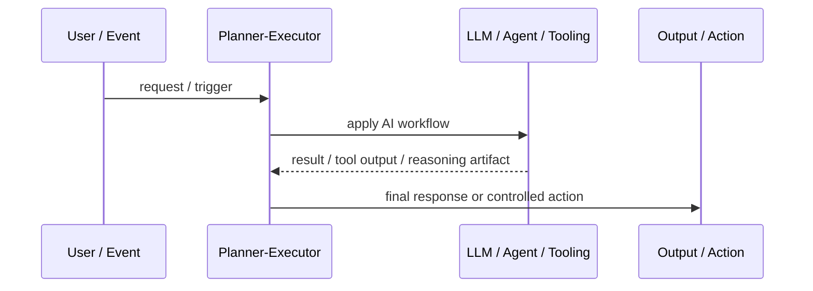
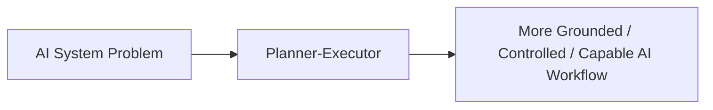

# Planner-Executor

## Core Idea

Planner-Executor separates high-level task planning from step-by-step execution.

---

## Problem It Solves

Complex tasks fail when the model jumps directly into execution without decomposing goals, constraints, dependencies, and verification steps.

---

## 3 Concrete Examples

### Example 1: Code Refactor Workflow

Planner breaks a refactor into files and tests; executor applies each change.

### Example 2: Research Report

Planner creates research questions and source plan; executor gathers and synthesizes evidence.

### Example 3: Migration Project

Planner sequences migration steps; executor performs tool calls and checks outcomes.

---

## Architect Questions

- What output should the planner produce?
- How detailed should the plan be?
- Can the executor revise the plan when reality changes?
- How is progress tracked?
- What validation happens after each step?
- When should a human approve the plan?

---

## Main Diagram



---

## Runtime / Agentic Flow



---

## Implementation Shape

```txt
1. Identify the AI failure mode or capability gap: missing knowledge, weak planning, unsafe action, poor routing, lack of memory, or low verification.
2. Define the workflow boundary: prompt, retriever, tool, agent, supervisor, memory, router, or human approval gate.
3. Define input/output contracts for each step.
4. Define safety controls: permissions, citations, validation, confidence thresholds, fallback, and audit logs.
5. Define evaluation: accuracy, grounding, tool success rate, latency, cost, user satisfaction, and failure cases.
6. Add observability: prompts, retrieved context, tool calls, routing decisions, model outputs, and human overrides.
7. Keep the pattern focused. Do not add agents where a deterministic workflow or simple retrieval system is enough.
```

---

## When to Use

- The task is complex enough to require decomposition.
- Execution steps need validation.
- Plans may need revision as work progresses.

---

## When Not to Use

- The task is simple and direct.
- Planning becomes verbose ceremony.
- The executor ignores or cannot adapt the plan.

---

## Common Smell That Suggests This Pattern

```txt
The AI system is hallucinating,
using stale knowledge,
choosing the wrong workflow,
taking unsafe actions,
losing task context,
or failing because one prompt is trying to do too much.
```

---

## Common Mistakes

```txt
Calling everything an agent.

Adding multiple agents when one workflow is enough.

Using RAG without measuring retrieval quality.

Letting tools run without authorization or confirmation.

Storing memory without consent, inspection, or deletion.

Routing semantically without fallback.

Evaluating only demos instead of failure cases.

Hiding uncertainty instead of exposing it clearly.
```

---

## Best Visual Summary



## Final Meaning

Planner-Executor is useful when it solves a real LLM or agent workflow problem. If a simpler deterministic design works, use that first.
