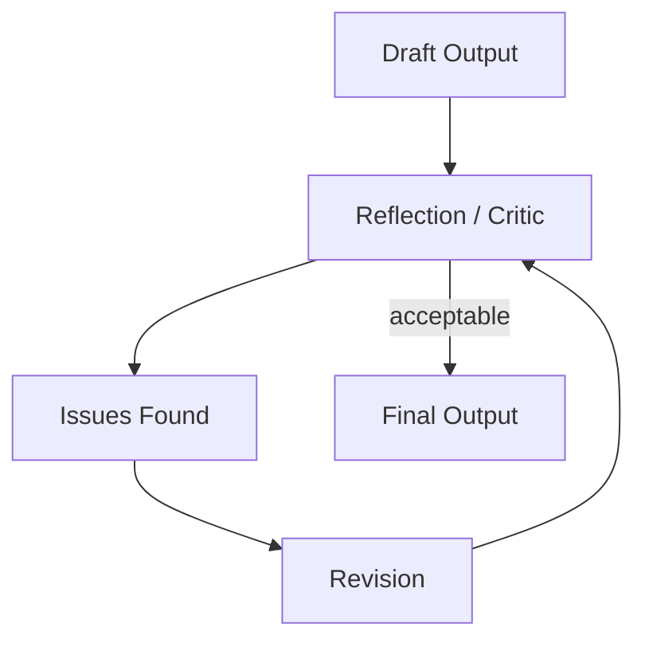
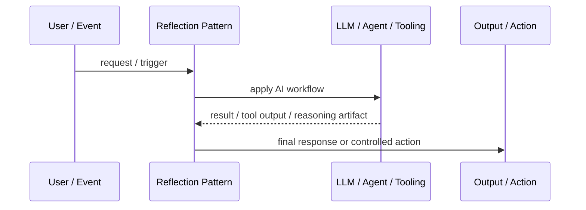
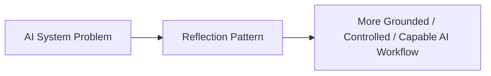

# Reflection Pattern

## Core Idea

Reflection Pattern makes a model critique, verify, or revise its own output or another agent's output before finalizing.

---

## Problem It Solves

First-pass LLM outputs often contain omissions, weak reasoning, formatting issues, or unchecked assumptions.

---

## 3 Concrete Examples

### Example 1: Answer Quality Review

A reflection step checks whether the answer actually addresses the user's constraints.

### Example 2: Code Review Agent

A reviewer model inspects generated code for bugs, missing tests, and style issues.

### Example 3: Plan Critique

A model critiques a proposed project plan for missing dependencies and risks.

---

## Architect Questions

- What should reflection check?
- Is the critic the same model or a separate role?
- How many revision loops are allowed?
- What stops infinite critique loops?
- What evidence can the critic use?
- Can reflection catch factual errors, or is external verification needed?

---

## Main Diagram



---

## Runtime / Agentic Flow



---

## Implementation Shape

```txt
1. Identify the AI failure mode or capability gap: missing knowledge, weak planning, unsafe action, poor routing, lack of memory, or low verification.
2. Define the workflow boundary: prompt, retriever, tool, agent, supervisor, memory, router, or human approval gate.
3. Define input/output contracts for each step.
4. Define safety controls: permissions, citations, validation, confidence thresholds, fallback, and audit logs.
5. Define evaluation: accuracy, grounding, tool success rate, latency, cost, user satisfaction, and failure cases.
6. Add observability: prompts, retrieved context, tool calls, routing decisions, model outputs, and human overrides.
7. Keep the pattern focused. Do not add agents where a deterministic workflow or simple retrieval system is enough.
```

---

## When to Use

- First-pass output quality is not enough.
- A critique/revision loop can catch issues.
- There are clear criteria for review.

---

## When Not to Use

- There are no objective review criteria.
- Reflection loops waste tokens without improving quality.
- External verification is needed but not used.

---

## Common Smell That Suggests This Pattern

```txt
The AI system is hallucinating,
using stale knowledge,
choosing the wrong workflow,
taking unsafe actions,
losing task context,
or failing because one prompt is trying to do too much.
```

---

## Common Mistakes

```txt
Calling everything an agent.

Adding multiple agents when one workflow is enough.

Using RAG without measuring retrieval quality.

Letting tools run without authorization or confirmation.

Storing memory without consent, inspection, or deletion.

Routing semantically without fallback.

Evaluating only demos instead of failure cases.

Hiding uncertainty instead of exposing it clearly.
```

---

## Best Visual Summary



## Final Meaning

Reflection Pattern is useful when it solves a real LLM or agent workflow problem. If a simpler deterministic design works, use that first.
