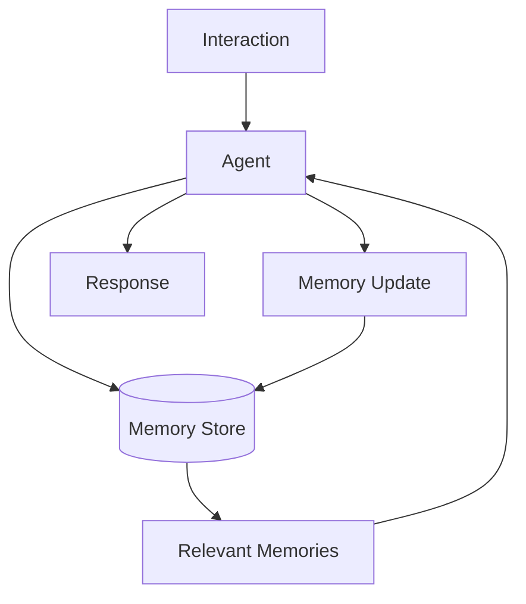
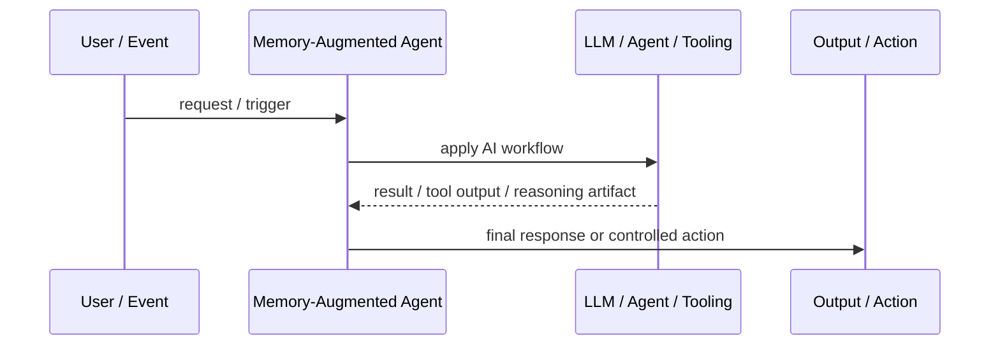
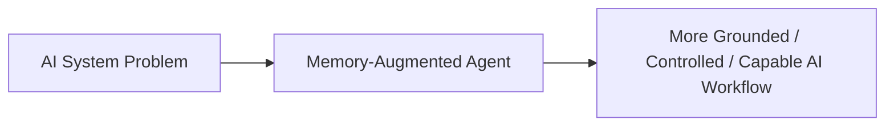

# Memory-Augmented Agent

## Core Idea

Memory-Augmented Agent stores and retrieves useful information across steps or sessions to improve continuity and personalization.

---

## Problem It Solves

Agents lose context across long workflows or repeated interactions unless important facts, preferences, and task state are persisted.

---

## 3 Concrete Examples

### Example 1: Personal Assistant Memory

The agent remembers user preferences for tone, format, and recurring workflows.

### Example 2: Long-Running Project Agent

The agent stores project decisions, open tasks, and architecture constraints.

### Example 3: Customer Support Agent

The agent remembers relevant case history and previous troubleshooting steps.

---

## Architect Questions

- What information is worth remembering?
- Is memory short-term, long-term, episodic, semantic, or task-specific?
- How is sensitive information handled?
- How can users inspect or delete memory?
- How is stale memory updated?
- How does retrieval decide what memory is relevant?

---

## Main Diagram



---

## Runtime / Agentic Flow



---

## Implementation Shape

```txt
1. Identify the AI failure mode or capability gap: missing knowledge, weak planning, unsafe action, poor routing, lack of memory, or low verification.
2. Define the workflow boundary: prompt, retriever, tool, agent, supervisor, memory, router, or human approval gate.
3. Define input/output contracts for each step.
4. Define safety controls: permissions, citations, validation, confidence thresholds, fallback, and audit logs.
5. Define evaluation: accuracy, grounding, tool success rate, latency, cost, user satisfaction, and failure cases.
6. Add observability: prompts, retrieved context, tool calls, routing decisions, model outputs, and human overrides.
7. Keep the pattern focused. Do not add agents where a deterministic workflow or simple retrieval system is enough.
```

---

## When to Use

- Continuity across turns or sessions is valuable.
- Stored facts improve task performance.
- Memory can be governed, updated, and deleted.

---

## When Not to Use

- Stored data would be sensitive or creepy without consent.
- Memory becomes stale and ungoverned.
- Short-term context is enough.

---

## Common Smell That Suggests This Pattern

```txt
The AI system is hallucinating,
using stale knowledge,
choosing the wrong workflow,
taking unsafe actions,
losing task context,
or failing because one prompt is trying to do too much.
```

---

## Common Mistakes

```txt
Calling everything an agent.

Adding multiple agents when one workflow is enough.

Using RAG without measuring retrieval quality.

Letting tools run without authorization or confirmation.

Storing memory without consent, inspection, or deletion.

Routing semantically without fallback.

Evaluating only demos instead of failure cases.

Hiding uncertainty instead of exposing it clearly.
```

---

## Best Visual Summary



## Final Meaning

Memory-Augmented Agent is useful when it solves a real LLM or agent workflow problem. If a simpler deterministic design works, use that first.
