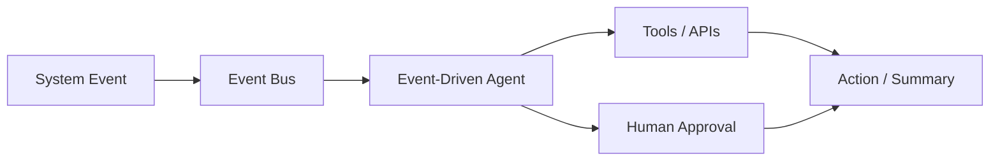
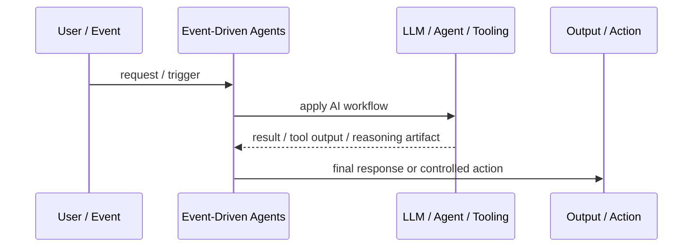
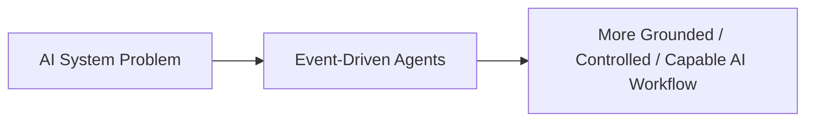

# Event-Driven Agents

## Core Idea

Event-Driven Agents wake up or act in response to events rather than only direct user prompts.

---

## Problem It Solves

Some workflows require agents to react to system changes, alerts, messages, schedules, or business events.

---

## 3 Concrete Examples

### Example 1: Incident Triage Agent

An alert event triggers an agent to collect logs and summarize likely causes.

### Example 2: Sales Follow-Up Agent

A CRM event triggers an agent to draft a follow-up email.

### Example 3: Data Quality Agent

A failed pipeline event triggers an agent to inspect errors and create a remediation ticket.

---

## Architect Questions

- What events should trigger the agent?
- What context is included in the event?
- What actions can the agent take automatically?
- Which actions require human approval?
- How are duplicate events handled?
- How are agent actions audited?

---

## Main Diagram



---

## Runtime / Agentic Flow



---

## Implementation Shape

```txt
1. Identify the AI failure mode or capability gap: missing knowledge, weak planning, unsafe action, poor routing, lack of memory, or low verification.
2. Define the workflow boundary: prompt, retriever, tool, agent, supervisor, memory, router, or human approval gate.
3. Define input/output contracts for each step.
4. Define safety controls: permissions, citations, validation, confidence thresholds, fallback, and audit logs.
5. Define evaluation: accuracy, grounding, tool success rate, latency, cost, user satisfaction, and failure cases.
6. Add observability: prompts, retrieved context, tool calls, routing decisions, model outputs, and human overrides.
7. Keep the pattern focused. Do not add agents where a deterministic workflow or simple retrieval system is enough.
```

---

## When to Use

- Agents need to react to alerts, messages, schedules, or business events.
- Event context is enough to start useful work.
- Actions are auditable and bounded.

---

## When Not to Use

- Events are noisy or low quality.
- The agent could take unsafe action automatically.
- Duplicate events and retries are not handled.

---

## Common Smell That Suggests This Pattern

```txt
The AI system is hallucinating,
using stale knowledge,
choosing the wrong workflow,
taking unsafe actions,
losing task context,
or failing because one prompt is trying to do too much.
```

---

## Common Mistakes

```txt
Calling everything an agent.

Adding multiple agents when one workflow is enough.

Using RAG without measuring retrieval quality.

Letting tools run without authorization or confirmation.

Storing memory without consent, inspection, or deletion.

Routing semantically without fallback.

Evaluating only demos instead of failure cases.

Hiding uncertainty instead of exposing it clearly.
```

---

## Best Visual Summary



## Final Meaning

Event-Driven Agents is useful when it solves a real LLM or agent workflow problem. If a simpler deterministic design works, use that first.
