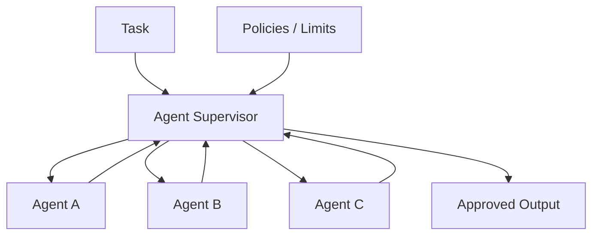
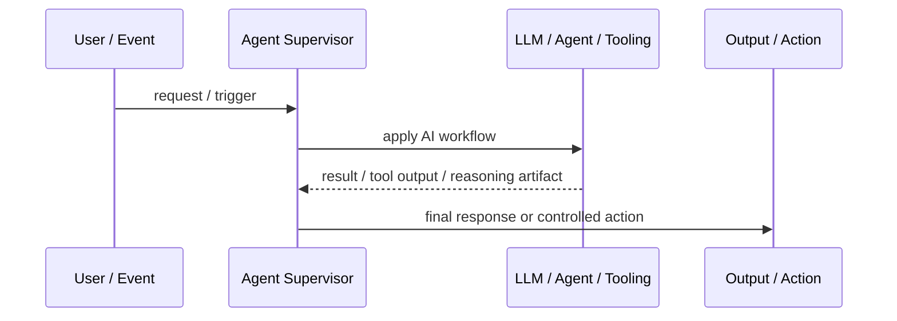
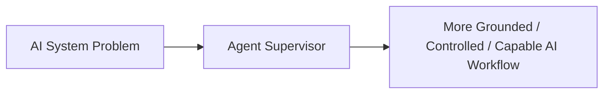

# Agent Supervisor

## Core Idea

Agent Supervisor monitors, coordinates, constrains, and evaluates one or more agents during task execution.

---

## Problem It Solves

Autonomous or semi-autonomous agents can drift, loop, misuse tools, exceed scope, or produce unsafe actions without oversight.

---

## 3 Concrete Examples

### Example 1: Coding Supervisor

Supervisor assigns tasks to coding agents, reviews diffs, and blocks risky changes.

### Example 2: Research Supervisor

Supervisor checks source quality and ensures all claims are cited.

### Example 3: Operations Supervisor

Supervisor allows diagnostic actions but requires approval for production changes.

---

## Architect Questions

- What agents does the supervisor control?
- What policies does it enforce?
- What actions require escalation?
- How are loops and runaway tool calls prevented?
- How does the supervisor judge success?
- What audit trail is produced?

---

## Main Diagram



---

## Runtime / Agentic Flow



---

## Implementation Shape

```txt
1. Identify the AI failure mode or capability gap: missing knowledge, weak planning, unsafe action, poor routing, lack of memory, or low verification.
2. Define the workflow boundary: prompt, retriever, tool, agent, supervisor, memory, router, or human approval gate.
3. Define input/output contracts for each step.
4. Define safety controls: permissions, citations, validation, confidence thresholds, fallback, and audit logs.
5. Define evaluation: accuracy, grounding, tool success rate, latency, cost, user satisfaction, and failure cases.
6. Add observability: prompts, retrieved context, tool calls, routing decisions, model outputs, and human overrides.
7. Keep the pattern focused. Do not add agents where a deterministic workflow or simple retrieval system is enough.
```

---

## When to Use

- Multiple agents or autonomous steps need oversight.
- Tool use must be constrained.
- Quality, safety, or scope control is required.

---

## When Not to Use

- There is only one simple deterministic flow.
- The supervisor adds latency without control value.
- Policies are vague and unenforceable.

---

## Common Smell That Suggests This Pattern

```txt
The AI system is hallucinating,
using stale knowledge,
choosing the wrong workflow,
taking unsafe actions,
losing task context,
or failing because one prompt is trying to do too much.
```

---

## Common Mistakes

```txt
Calling everything an agent.

Adding multiple agents when one workflow is enough.

Using RAG without measuring retrieval quality.

Letting tools run without authorization or confirmation.

Storing memory without consent, inspection, or deletion.

Routing semantically without fallback.

Evaluating only demos instead of failure cases.

Hiding uncertainty instead of exposing it clearly.
```

---

## Best Visual Summary



## Final Meaning

Agent Supervisor is useful when it solves a real LLM or agent workflow problem. If a simpler deterministic design works, use that first.
