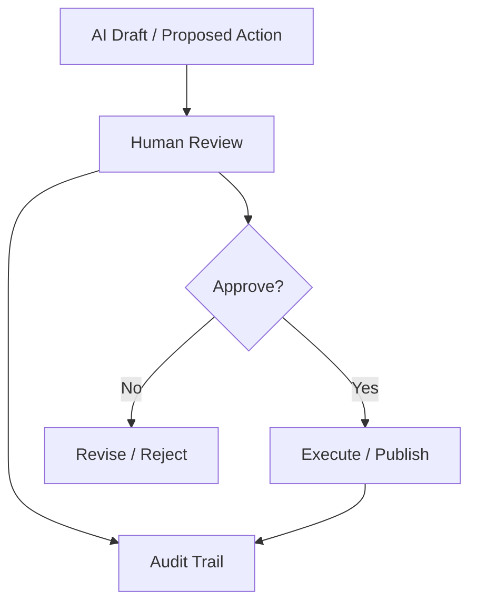
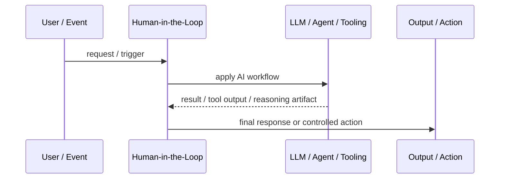
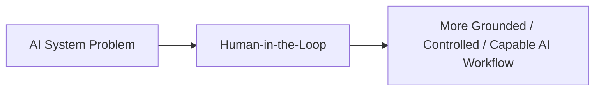

# Human-in-the-Loop

## Core Idea

Human-in-the-Loop inserts human review, approval, correction, or decision-making into an AI workflow.

---

## Problem It Solves

Some AI actions are too risky, ambiguous, regulated, or subjective to automate fully.

---

## 3 Concrete Examples

### Example 1: Production Change Approval

An agent proposes a database migration, but a human approves before execution.

### Example 2: Medical Summary Review

The model drafts a summary that a clinician reviews before use.

### Example 3: Customer Refund Decision

The agent recommends a refund decision, but a support lead approves high-value refunds.

---

## Architect Questions

- Which decisions require human review?
- What information should the human see?
- Can the human edit, reject, or approve?
- What is the SLA for human review?
- How are decisions audited?
- How is feedback used to improve the workflow?

---

## Main Diagram



---

## Runtime / Agentic Flow



---

## Implementation Shape

```txt
1. Identify the AI failure mode or capability gap: missing knowledge, weak planning, unsafe action, poor routing, lack of memory, or low verification.
2. Define the workflow boundary: prompt, retriever, tool, agent, supervisor, memory, router, or human approval gate.
3. Define input/output contracts for each step.
4. Define safety controls: permissions, citations, validation, confidence thresholds, fallback, and audit logs.
5. Define evaluation: accuracy, grounding, tool success rate, latency, cost, user satisfaction, and failure cases.
6. Add observability: prompts, retrieved context, tool calls, routing decisions, model outputs, and human overrides.
7. Keep the pattern focused. Do not add agents where a deterministic workflow or simple retrieval system is enough.
```

---

## When to Use

- Decisions are high-risk, ambiguous, regulated, or subjective.
- Human review improves safety or trust.
- The workflow can tolerate review latency.

---

## When Not to Use

- Automation risk is low and review adds unnecessary delay.
- Humans are rubber-stamping without real oversight.
- Review context is insufficient for decisions.

---

## Common Smell That Suggests This Pattern

```txt
The AI system is hallucinating,
using stale knowledge,
choosing the wrong workflow,
taking unsafe actions,
losing task context,
or failing because one prompt is trying to do too much.
```

---

## Common Mistakes

```txt
Calling everything an agent.

Adding multiple agents when one workflow is enough.

Using RAG without measuring retrieval quality.

Letting tools run without authorization or confirmation.

Storing memory without consent, inspection, or deletion.

Routing semantically without fallback.

Evaluating only demos instead of failure cases.

Hiding uncertainty instead of exposing it clearly.
```

---

## Best Visual Summary



## Final Meaning

Human-in-the-Loop is useful when it solves a real LLM or agent workflow problem. If a simpler deterministic design works, use that first.
