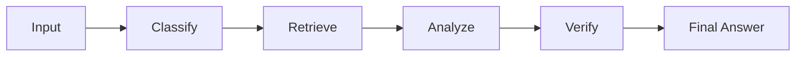
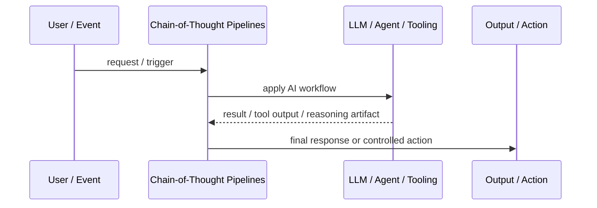
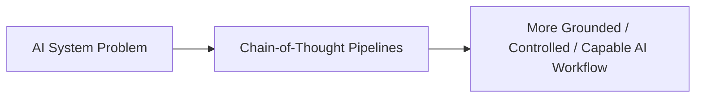

# Chain-of-Thought Pipelines

## Core Idea

Chain-of-Thought Pipelines decompose reasoning into explicit stages such as classify, retrieve, analyze, verify, and answer, while exposing only safe outputs.

---

## Problem It Solves

One-shot generation is brittle for tasks that require multi-step reasoning, validation, and transformation.

---

## 3 Concrete Examples

### Example 1: Support Diagnosis Pipeline

Classify issue, retrieve docs, infer likely cause, verify against logs, then draft response.

### Example 2: Contract Review Pipeline

Extract clauses, classify risks, compare policy, summarize findings.

### Example 3: Data Analysis Pipeline

Interpret question, generate query, validate result, explain output.

---

## Architect Questions

- What reasoning stages are needed?
- Which intermediate outputs should be stored or hidden?
- Where is external verification needed?
- How are stage failures handled?
- Can stages be tested independently?
- How is sensitive reasoning protected from user-visible output?

---

## Main Diagram



---

## Runtime / Agentic Flow



---

## Implementation Shape

```txt
1. Identify the AI failure mode or capability gap: missing knowledge, weak planning, unsafe action, poor routing, lack of memory, or low verification.
2. Define the workflow boundary: prompt, retriever, tool, agent, supervisor, memory, router, or human approval gate.
3. Define input/output contracts for each step.
4. Define safety controls: permissions, citations, validation, confidence thresholds, fallback, and audit logs.
5. Define evaluation: accuracy, grounding, tool success rate, latency, cost, user satisfaction, and failure cases.
6. Add observability: prompts, retrieved context, tool calls, routing decisions, model outputs, and human overrides.
7. Keep the pattern focused. Do not add agents where a deterministic workflow or simple retrieval system is enough.
```

---

## When to Use

- The task benefits from staged reasoning and verification.
- Intermediate stages can be tested.
- Only safe final outputs should be exposed.

---

## When Not to Use

- A single step is enough.
- Intermediate outputs expose sensitive reasoning unnecessarily.
- The pipeline hides errors instead of validating them.

---

## Common Smell That Suggests This Pattern

```txt
The AI system is hallucinating,
using stale knowledge,
choosing the wrong workflow,
taking unsafe actions,
losing task context,
or failing because one prompt is trying to do too much.
```

---

## Common Mistakes

```txt
Calling everything an agent.

Adding multiple agents when one workflow is enough.

Using RAG without measuring retrieval quality.

Letting tools run without authorization or confirmation.

Storing memory without consent, inspection, or deletion.

Routing semantically without fallback.

Evaluating only demos instead of failure cases.

Hiding uncertainty instead of exposing it clearly.
```

---

## Best Visual Summary



## Final Meaning

Chain-of-Thought Pipelines is useful when it solves a real LLM or agent workflow problem. If a simpler deterministic design works, use that first.
