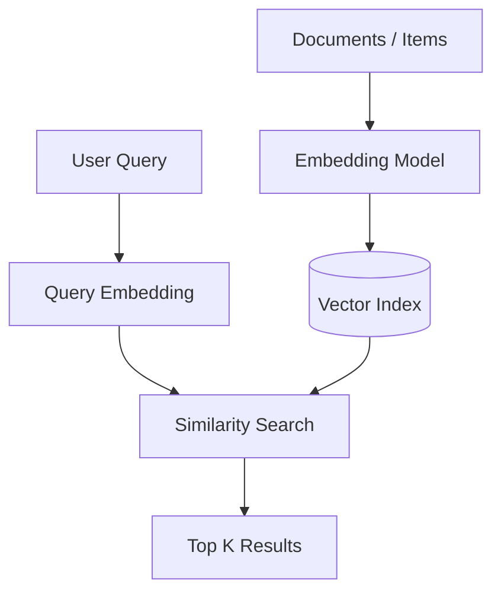
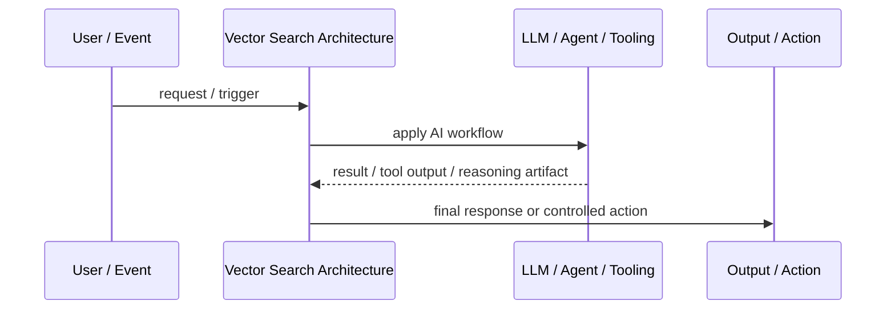
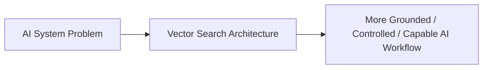

# Vector Search Architecture

## Core Idea

Vector Search Architecture stores embeddings and retrieves semantically similar content based on vector distance.

---

## Problem It Solves

Keyword search misses relevant content when users phrase questions differently from source documents.

---

## 3 Concrete Examples

### Example 1: Document Q&A

User questions retrieve semantically similar document chunks.

### Example 2: Product Search

Customers search by intent, not exact product keywords.

### Example 3: Support Ticket Similarity

New tickets are matched to similar historical cases.

---

## Architect Questions

- What content should be embedded?
- What embedding model is used?
- What chunking strategy is used?
- What metadata filters are required?
- How are embeddings refreshed when content changes?
- Is hybrid keyword plus vector search needed?

---

## Main Diagram



---

## Runtime / Agentic Flow



---

## Implementation Shape

```txt
1. Identify the AI failure mode or capability gap: missing knowledge, weak planning, unsafe action, poor routing, lack of memory, or low verification.
2. Define the workflow boundary: prompt, retriever, tool, agent, supervisor, memory, router, or human approval gate.
3. Define input/output contracts for each step.
4. Define safety controls: permissions, citations, validation, confidence thresholds, fallback, and audit logs.
5. Define evaluation: accuracy, grounding, tool success rate, latency, cost, user satisfaction, and failure cases.
6. Add observability: prompts, retrieved context, tool calls, routing decisions, model outputs, and human overrides.
7. Keep the pattern focused. Do not add agents where a deterministic workflow or simple retrieval system is enough.
```

---

## When to Use

- Semantic similarity matters.
- Users do not know exact keywords.
- Documents/items can be embedded and indexed.

---

## When Not to Use

- Exact keyword or structured search is enough.
- Embeddings are stale or poorly chunked.
- Permission filtering cannot be enforced.

---

## Common Smell That Suggests This Pattern

```txt
The AI system is hallucinating,
using stale knowledge,
choosing the wrong workflow,
taking unsafe actions,
losing task context,
or failing because one prompt is trying to do too much.
```

---

## Common Mistakes

```txt
Calling everything an agent.

Adding multiple agents when one workflow is enough.

Using RAG without measuring retrieval quality.

Letting tools run without authorization or confirmation.

Storing memory without consent, inspection, or deletion.

Routing semantically without fallback.

Evaluating only demos instead of failure cases.

Hiding uncertainty instead of exposing it clearly.
```

---

## Best Visual Summary



## Final Meaning

Vector Search Architecture is useful when it solves a real LLM or agent workflow problem. If a simpler deterministic design works, use that first.
