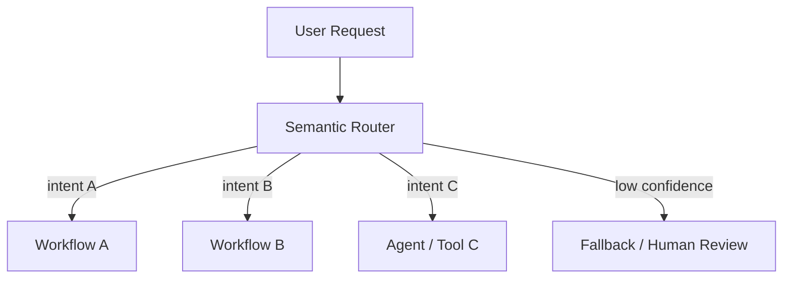
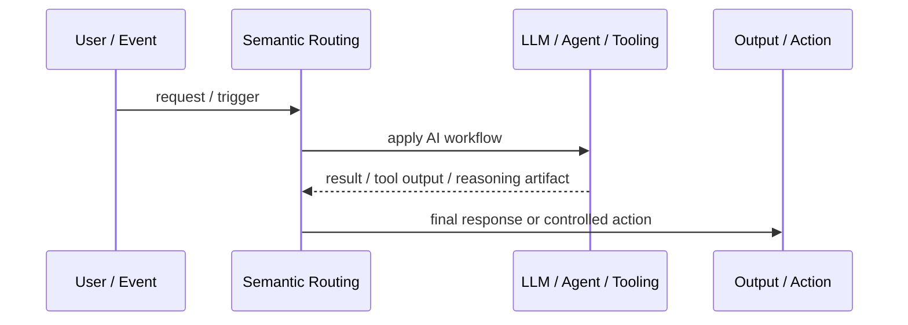
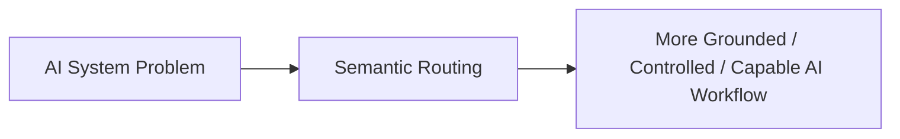

# Semantic Routing

## Core Idea

Semantic Routing sends a user request to the right model, tool, agent, workflow, or knowledge source based on meaning rather than only keywords.

---

## Problem It Solves

AI systems need to choose different handling paths for different intents, domains, risks, or capabilities.

---

## 3 Concrete Examples

### Example 1: Support Intent Routing

Billing questions go to billing workflow; technical issues go to troubleshooting workflow.

### Example 2: Model Routing

Simple questions use a cheaper model; complex reasoning tasks use a stronger model.

### Example 3: Tool Routing

Data questions route to SQL tools while policy questions route to document retrieval.

---

## Architect Questions

- What routes exist?
- What signals determine route selection?
- Is routing classifier-based, embedding-based, rules-based, or hybrid?
- What confidence threshold is required?
- What is the fallback route?
- How are misroutes detected and corrected?

---

## Main Diagram



---

## Runtime / Agentic Flow



---

## Implementation Shape

```txt
1. Identify the AI failure mode or capability gap: missing knowledge, weak planning, unsafe action, poor routing, lack of memory, or low verification.
2. Define the workflow boundary: prompt, retriever, tool, agent, supervisor, memory, router, or human approval gate.
3. Define input/output contracts for each step.
4. Define safety controls: permissions, citations, validation, confidence thresholds, fallback, and audit logs.
5. Define evaluation: accuracy, grounding, tool success rate, latency, cost, user satisfaction, and failure cases.
6. Add observability: prompts, retrieved context, tool calls, routing decisions, model outputs, and human overrides.
7. Keep the pattern focused. Do not add agents where a deterministic workflow or simple retrieval system is enough.
```

---

## When to Use

- Different requests need different models, agents, tools, or workflows.
- Intent classification improves cost, quality, or safety.
- Fallback handling is available.

---

## When Not to Use

- There is only one meaningful path.
- Misrouting risk is higher than benefit.
- No fallback exists for low-confidence routing.

---

## Common Smell That Suggests This Pattern

```txt
The AI system is hallucinating,
using stale knowledge,
choosing the wrong workflow,
taking unsafe actions,
losing task context,
or failing because one prompt is trying to do too much.
```

---

## Common Mistakes

```txt
Calling everything an agent.

Adding multiple agents when one workflow is enough.

Using RAG without measuring retrieval quality.

Letting tools run without authorization or confirmation.

Storing memory without consent, inspection, or deletion.

Routing semantically without fallback.

Evaluating only demos instead of failure cases.

Hiding uncertainty instead of exposing it clearly.
```

---

## Best Visual Summary



## Final Meaning

Semantic Routing is useful when it solves a real LLM or agent workflow problem. If a simpler deterministic design works, use that first.
