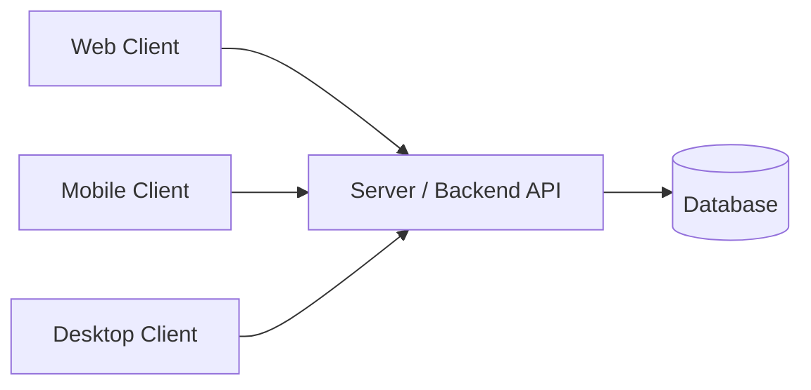
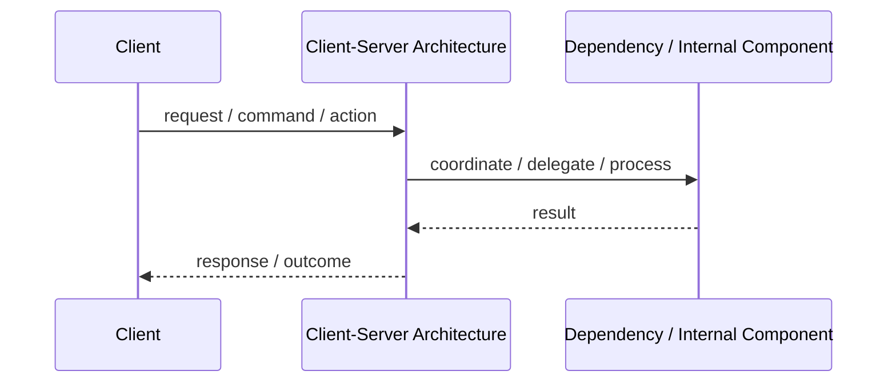
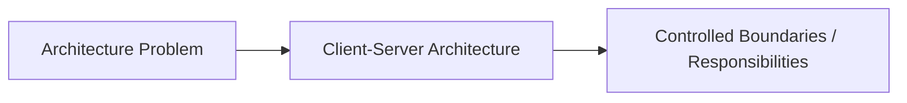

# Client-Server Architecture

## Core Idea

Client-Server separates the system into clients that request services and servers that provide services.

---

## Problem It Solves

A system needs multiple users or applications to access shared data or shared business capabilities without duplicating the full system on every device.

---

## Common Examples

- Web browser and web server
- Mobile app and backend API
- Desktop app and central database service

---

## Architect Questions

- What runs on the client and what runs on the server?
- Does the client need offline behavior?
- How much business logic should live on the server?
- How will authentication and authorization be enforced?
- Can the server scale to many clients?
- What happens if the network is slow or unavailable?

---

## Main Diagram



---

## Runtime / Responsibility Flow



---

## Implementation Shape

```txt
1. Identify the main architectural problem.
2. Identify the primary responsibilities.
3. Define boundaries and contracts.
4. Decide communication style.
5. Decide ownership of state and data.
6. Add operational rules: testing, deployment, monitoring, failure handling.
7. Keep the pattern honest; do not use the name without enforcing the rules.
```

---

## When to Use

- Multiple clients need centralized access to data or services.
- You want a clear separation between user interface and backend processing.
- Business rules should be controlled centrally.
- Clients may be web, mobile, desktop, or external integrations.

---

## When Not to Use

- The system is fully local and does not need shared state.
- Network dependency is unacceptable.
- The server would become an unnecessary bottleneck.

---

## Common Smell That Suggests This Pattern

```txt
The current design is forcing one part of the system to know too much,
coordinate too much,
or change too often because boundaries are unclear.
```

---

## Common Mistakes

```txt
Using the pattern name without enforcing its boundaries.

Adding complexity before the problem is real.

Letting shared code, shared databases, or hidden dependencies break the architecture.

Confusing folder structure with actual architecture.

Ignoring operational concerns such as deployment, monitoring, scaling, and failure behavior.
```

---

## Best Visual Summary



## Final Meaning

Client-Server Architecture is useful when it directly solves the stated problem. If the problem is not real yet, the pattern may only add complexity.
