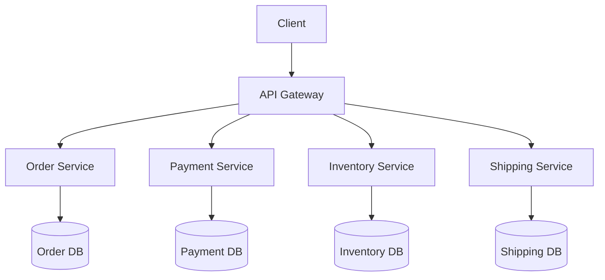
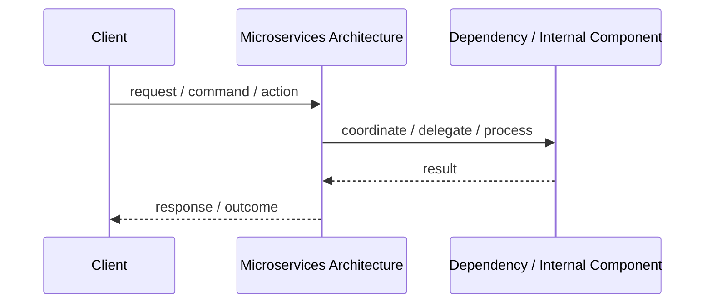

# Microservices Architecture

## Core Idea

Microservices split a system into independently deployable services, each owning a specific business capability.

---

## Problem It Solves

A large system needs independent scaling, deployment, ownership, and failure isolation across business capabilities.

---

## Common Examples

- Order service
- Payment service
- Inventory service

---

## Architect Questions

- Are the business boundaries clear and stable?
- Do teams need independent deployment?
- Does each service own its data?
- How will services communicate?
- How will distributed tracing, logging, retries, and failures be handled?
- Is the organization mature enough to operate distributed systems?

---

## Main Diagram



---

## Runtime / Responsibility Flow



---

## Implementation Shape

```txt
1. Identify the main architectural problem.
2. Identify the primary responsibilities.
3. Define boundaries and contracts.
4. Decide communication style.
5. Decide ownership of state and data.
6. Add operational rules: testing, deployment, monitoring, failure handling.
7. Keep the pattern honest; do not use the name without enforcing the rules.
```

---

## When to Use

- Different capabilities need independent scaling.
- Different teams own different services.
- Independent deployment is valuable.
- Failure isolation is important.
- The organization has strong DevOps and observability practices.

---

## When Not to Use

- The team is small and the domain boundaries are unclear.
- You are trying to fix messy code by distributing it.
- You do not have monitoring, tracing, CI/CD, and operational maturity.
- Transactions must stay simple and strongly consistent across many modules.

---

## Common Smell That Suggests This Pattern

```txt
The current design is forcing one part of the system to know too much,
coordinate too much,
or change too often because boundaries are unclear.
```

---

## Common Mistakes

```txt
Using the pattern name without enforcing its boundaries.

Adding complexity before the problem is real.

Letting shared code, shared databases, or hidden dependencies break the architecture.

Confusing folder structure with actual architecture.

Ignoring operational concerns such as deployment, monitoring, scaling, and failure behavior.
```

---

## Best Visual Summary


## Final Meaning

Microservices Architecture is useful when it directly solves the stated problem. If the problem is not real yet, the pattern may only add complexity.
