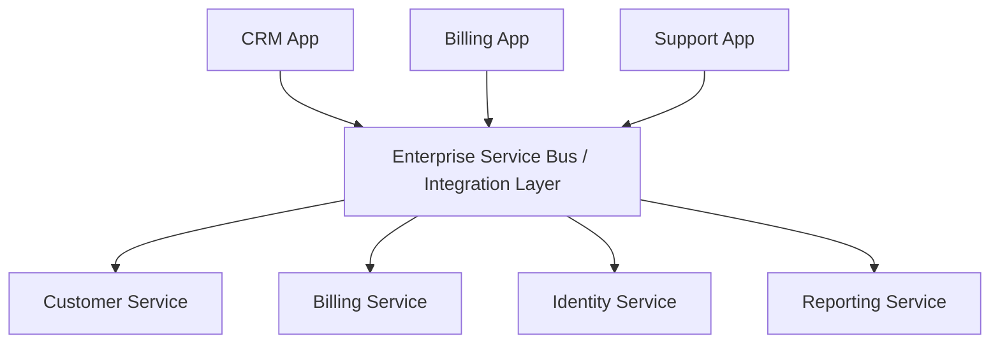
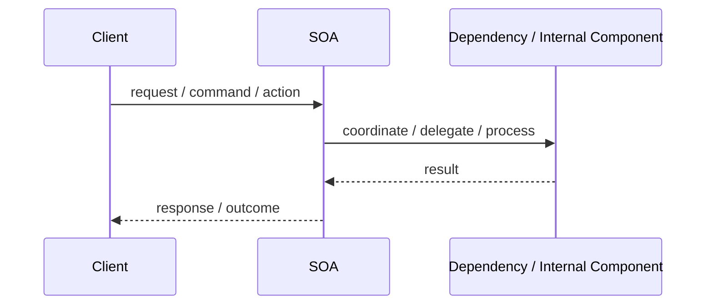
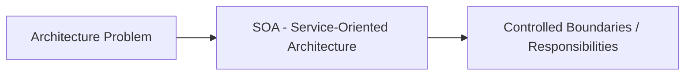

# SOA - Service-Oriented Architecture

## Core Idea

SOA organizes enterprise systems around reusable services that expose business capabilities, often integrated through shared infrastructure such as an enterprise service bus.

---

## Problem It Solves

An enterprise has many applications that need to share capabilities such as customer lookup, billing, identity, and reporting.

---

## Common Examples

- Customer service reused by CRM and billing
- Enterprise identity service
- Shared billing service

---

## Architect Questions

- Which services represent reusable enterprise capabilities?
- Will services be shared across multiple applications?
- Do we need orchestration or a service bus?
- How will service contracts be versioned?
- How will governance prevent service sprawl?
- Are services too coarse or too fine-grained?

---

## Main Diagram



---

## Runtime / Responsibility Flow



---

## Implementation Shape

```txt
1. Identify the main architectural problem.
2. Identify the primary responsibilities.
3. Define boundaries and contracts.
4. Decide communication style.
5. Decide ownership of state and data.
6. Add operational rules: testing, deployment, monitoring, failure handling.
7. Keep the pattern honest; do not use the name without enforcing the rules.
```

---

## When to Use

- Multiple enterprise applications need shared business capabilities.
- Reuse and governance matter more than small autonomous teams.
- Legacy systems need integration behind service contracts.
- Enterprise workflows span multiple systems.

---

## When Not to Use

- You only need a small product architecture.
- Governance would slow delivery without providing value.
- A centralized ESB would become a bottleneck or god system.

---

## Common Smell That Suggests This Pattern

```txt
The current design is forcing one part of the system to know too much,
coordinate too much,
or change too often because boundaries are unclear.
```

---

## Common Mistakes

```txt
Using the pattern name without enforcing its boundaries.

Adding complexity before the problem is real.

Letting shared code, shared databases, or hidden dependencies break the architecture.

Confusing folder structure with actual architecture.

Ignoring operational concerns such as deployment, monitoring, scaling, and failure behavior.
```

---

## Best Visual Summary



## Final Meaning

SOA - Service-Oriented Architecture is useful when it directly solves the stated problem. If the problem is not real yet, the pattern may only add complexity.
