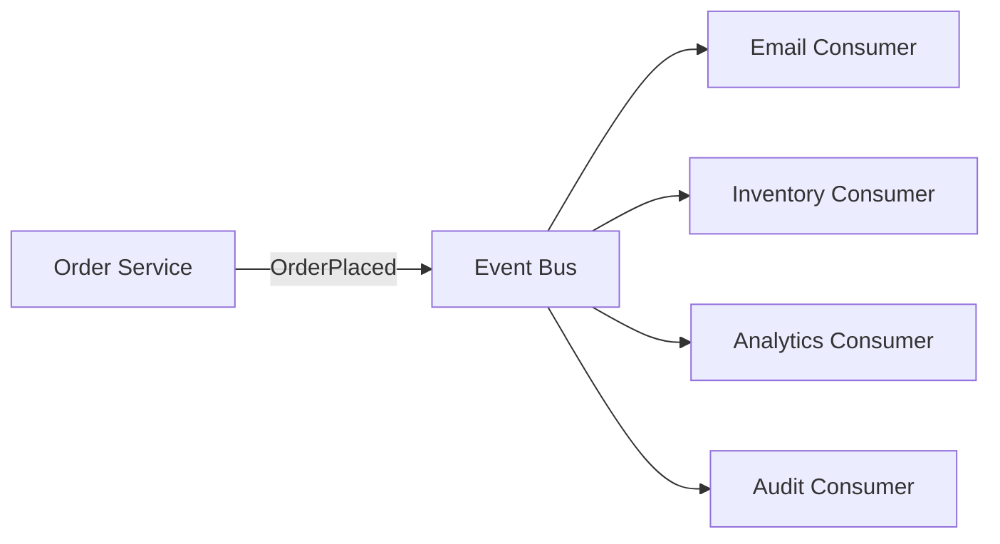
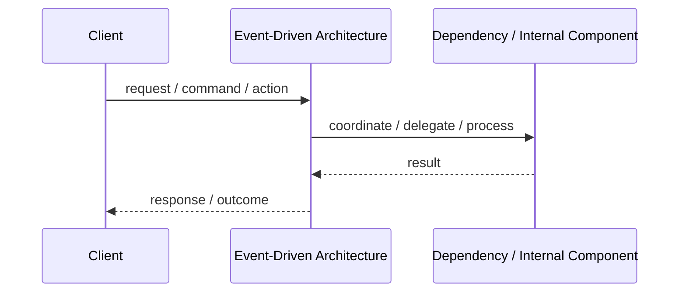
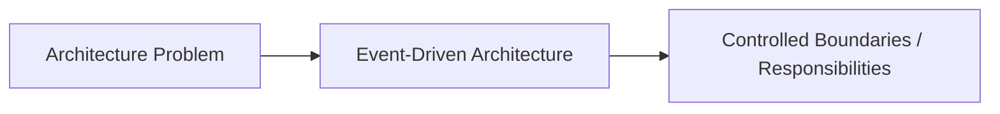

# Event-Driven Architecture

## Core Idea

Event-Driven Architecture uses events to notify parts of the system that something happened, allowing producers and consumers to be decoupled.

---

## Problem It Solves

Multiple parts of a system need to react to business changes without the original action directly calling every dependent process.

---

## Common Examples

- OrderPlaced triggers email, inventory, analytics
- UserRegistered triggers onboarding
- PaymentFailed triggers retry workflow

---

## Architect Questions

- What business events matter?
- Who publishes each event?
- Who consumes each event?
- Do consumers need immediate consistency or eventual consistency?
- How will failed event handling be retried?
- How will event schemas be versioned?

---

## Main Diagram



---

## Runtime / Responsibility Flow



---

## Implementation Shape

```txt
1. Identify the main architectural problem.
2. Identify the primary responsibilities.
3. Define boundaries and contracts.
4. Decide communication style.
5. Decide ownership of state and data.
6. Add operational rules: testing, deployment, monitoring, failure handling.
7. Keep the pattern honest; do not use the name without enforcing the rules.
```

---

## When to Use

- Many independent reactions happen after a business action.
- Loose coupling is more important than immediate consistency.
- You need scalable asynchronous processing.
- Auditability and event history are useful.

---

## When Not to Use

- The workflow requires immediate synchronous answers.
- The team cannot manage retries, duplicates, ordering, and observability.
- Events are used to hide unclear business workflow.

---

## Common Smell That Suggests This Pattern

```txt
The current design is forcing one part of the system to know too much,
coordinate too much,
or change too often because boundaries are unclear.
```

---

## Common Mistakes

```txt
Using the pattern name without enforcing its boundaries.

Adding complexity before the problem is real.

Letting shared code, shared databases, or hidden dependencies break the architecture.

Confusing folder structure with actual architecture.

Ignoring operational concerns such as deployment, monitoring, scaling, and failure behavior.
```

---

## Best Visual Summary



## Final Meaning

Event-Driven Architecture is useful when it directly solves the stated problem. If the problem is not real yet, the pattern may only add complexity.
