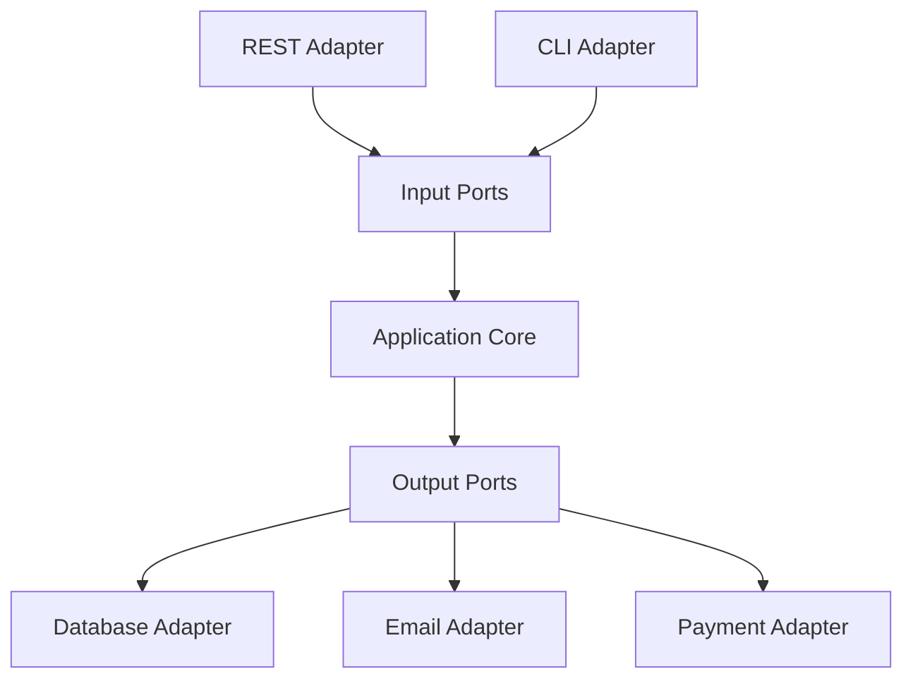
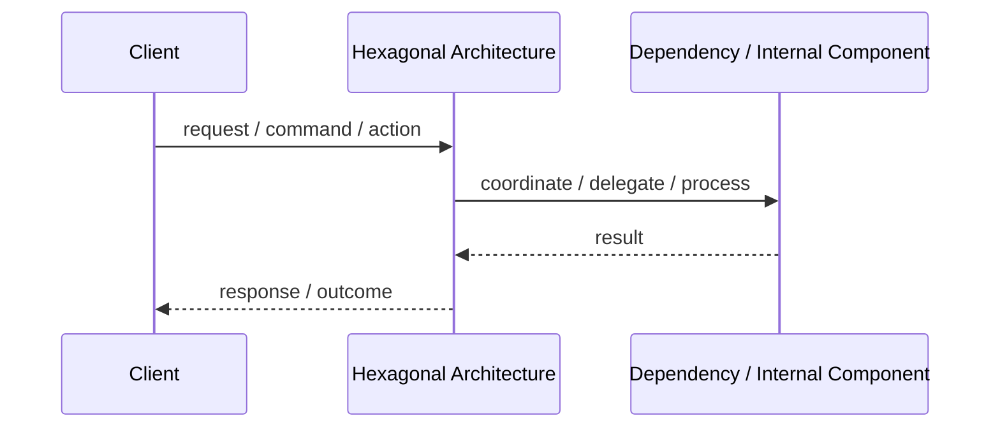
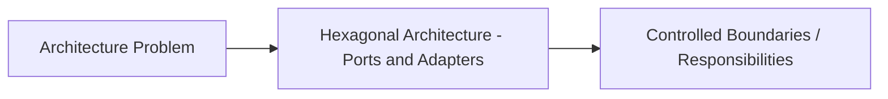

# Hexagonal Architecture - Ports and Adapters

## Core Idea

Hexagonal Architecture isolates the application core from external systems using ports and adapters.

---

## Problem It Solves

Business logic becomes polluted by frameworks, databases, UI code, vendor SDKs, and infrastructure details.

---

## Common Examples

- Core business logic independent from REST and database
- Swap database adapter without changing use cases
- Test application core without real infrastructure

---

## Architect Questions

- What is the application core?
- What are the input ports?
- What output ports does the core need?
- Which external systems need adapters?
- Can business logic be tested without database or HTTP?
- Are dependencies pointing toward the core?

---

## Main Diagram



---

## Runtime / Responsibility Flow



---

## Implementation Shape

```txt
1. Identify the main architectural problem.
2. Identify the primary responsibilities.
3. Define boundaries and contracts.
4. Decide communication style.
5. Decide ownership of state and data.
6. Add operational rules: testing, deployment, monitoring, failure handling.
7. Keep the pattern honest; do not use the name without enforcing the rules.
```

---

## When to Use

- Business logic must be protected from infrastructure.
- You need high testability.
- External systems may change.
- You want clear boundaries between core and adapters.

---

## When Not to Use

- The system is simple CRUD with little business logic.
- The abstraction overhead is not justified.
- The team does not understand dependency inversion.

---

## Common Smell That Suggests This Pattern

```txt
The current design is forcing one part of the system to know too much,
coordinate too much,
or change too often because boundaries are unclear.
```

---

## Common Mistakes

```txt
Using the pattern name without enforcing its boundaries.

Adding complexity before the problem is real.

Letting shared code, shared databases, or hidden dependencies break the architecture.

Confusing folder structure with actual architecture.

Ignoring operational concerns such as deployment, monitoring, scaling, and failure behavior.
```

---

## Best Visual Summary



## Final Meaning

Hexagonal Architecture - Ports and Adapters is useful when it directly solves the stated problem. If the problem is not real yet, the pattern may only add complexity.
