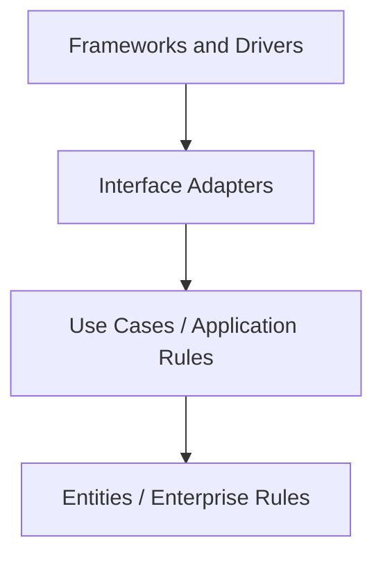
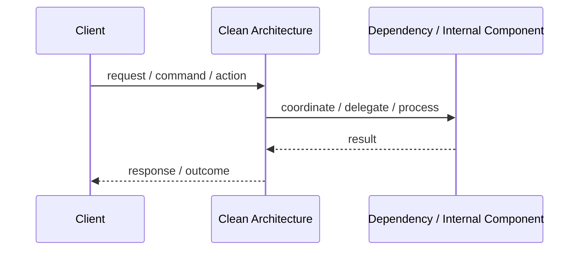
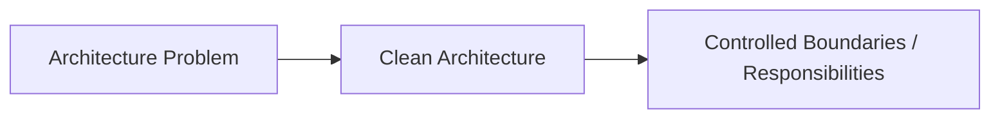

# Clean Architecture

## Core Idea

Clean Architecture places business rules at the center and makes dependencies point inward.

---

## Problem It Solves

Business logic becomes dependent on frameworks, databases, UI, and external tools, making the system hard to test and change.

---

## Common Examples

- Entities independent of database
- Use cases independent of controllers
- Infrastructure implements interfaces defined by inner layers

---

## Architect Questions

- What are the enterprise business rules?
- What are the application use cases?
- Which dependencies point inward?
- Are frameworks kept at the outer layer?
- Can use cases be tested without UI and database?
- Are interfaces owned by the inner layers?

---

## Main Diagram



---

## Runtime / Responsibility Flow



---

## Implementation Shape

```txt
1. Identify the main architectural problem.
2. Identify the primary responsibilities.
3. Define boundaries and contracts.
4. Decide communication style.
5. Decide ownership of state and data.
6. Add operational rules: testing, deployment, monitoring, failure handling.
7. Keep the pattern honest; do not use the name without enforcing the rules.
```

---

## When to Use

- The domain is important and long-lived.
- You need strong testability.
- Frameworks and infrastructure should be replaceable.
- Business rules should survive UI or database changes.

---

## When Not to Use

- The app is very small or mostly CRUD.
- The team will create layers without understanding dependency direction.
- The extra abstraction slows delivery without protecting important logic.

---

## Common Smell That Suggests This Pattern

```txt
The current design is forcing one part of the system to know too much,
coordinate too much,
or change too often because boundaries are unclear.
```

---

## Common Mistakes

```txt
Using the pattern name without enforcing its boundaries.

Adding complexity before the problem is real.

Letting shared code, shared databases, or hidden dependencies break the architecture.

Confusing folder structure with actual architecture.

Ignoring operational concerns such as deployment, monitoring, scaling, and failure behavior.
```

---

## Best Visual Summary



## Final Meaning

Clean Architecture is useful when it directly solves the stated problem. If the problem is not real yet, the pattern may only add complexity.
