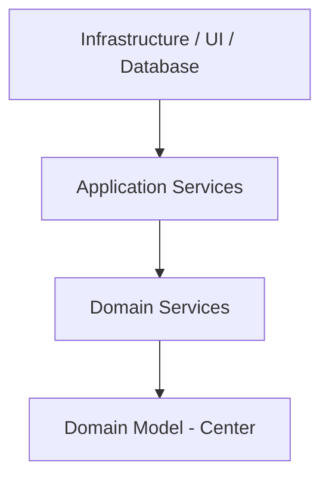
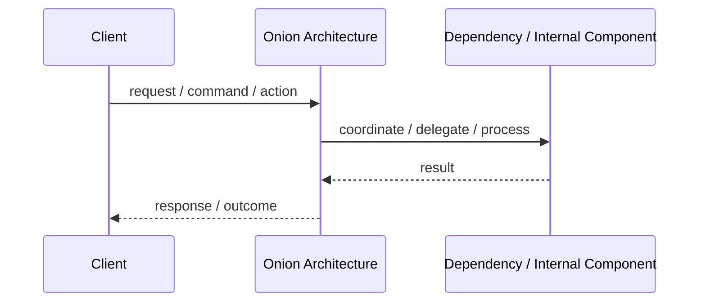
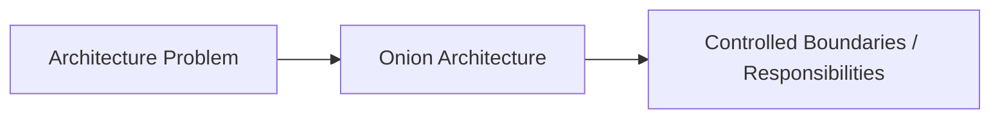

# Onion Architecture

## Core Idea

Onion Architecture organizes the system in concentric layers around the domain model, with dependencies pointing inward.

---

## Problem It Solves

The domain model is too dependent on infrastructure and application frameworks.

---

## Common Examples

- Domain entities at the center
- Repositories as interfaces near the domain
- Database implementation outside

---

## Architect Questions

- What is the core domain model?
- What domain services exist?
- What application services coordinate use cases?
- Which infrastructure details must stay outside?
- Do dependencies point inward?
- Can infrastructure be replaced without domain changes?

---

## Main Diagram



---

## Runtime / Responsibility Flow



---

## Implementation Shape

```txt
1. Identify the main architectural problem.
2. Identify the primary responsibilities.
3. Define boundaries and contracts.
4. Decide communication style.
5. Decide ownership of state and data.
6. Add operational rules: testing, deployment, monitoring, failure handling.
7. Keep the pattern honest; do not use the name without enforcing the rules.
```

---

## When to Use

- The domain model is important.
- You want infrastructure independence.
- Business rules need strong protection.
- You want testable domain behavior.

---

## When Not to Use

- The domain is weak and mostly CRUD.
- The layers are created mechanically without useful boundaries.
- The team does not need heavy domain protection.

---

## Common Smell That Suggests This Pattern

```txt
The current design is forcing one part of the system to know too much,
coordinate too much,
or change too often because boundaries are unclear.
```

---

## Common Mistakes

```txt
Using the pattern name without enforcing its boundaries.

Adding complexity before the problem is real.

Letting shared code, shared databases, or hidden dependencies break the architecture.

Confusing folder structure with actual architecture.

Ignoring operational concerns such as deployment, monitoring, scaling, and failure behavior.
```

---

## Best Visual Summary



## Final Meaning

Onion Architecture is useful when it directly solves the stated problem. If the problem is not real yet, the pattern may only add complexity.
