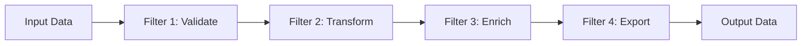
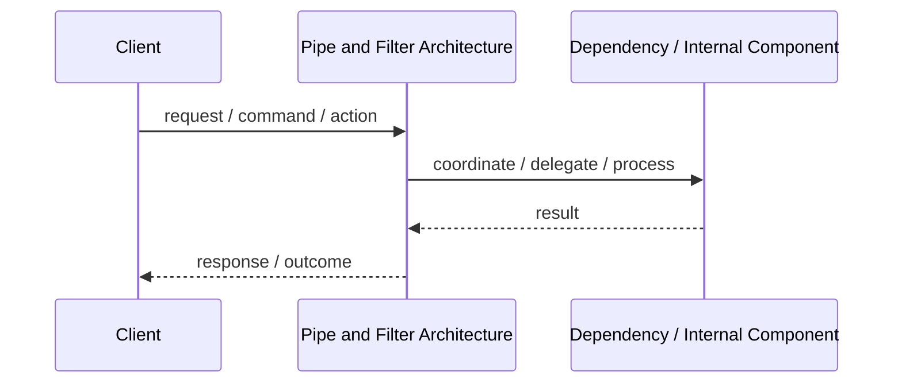
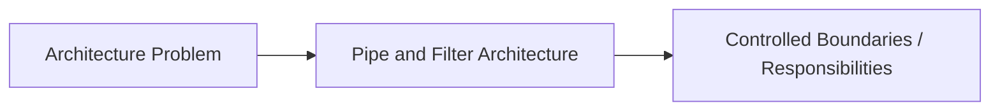

# Pipe and Filter Architecture

## Core Idea

Pipe and Filter breaks processing into independent filters connected by pipes, where each filter transforms data and passes it to the next stage.

---

## Problem It Solves

A process requires multiple independent transformations that should be reusable, composable, and easier to test.

---

## Common Examples

- ETL pipeline
- Image processing pipeline
- Compiler phases

---

## Architect Questions

- Can the workflow be broken into independent stages?
- What data format flows between stages?
- Can filters be reused in different pipelines?
- Does order matter?
- Can filters run streaming or batch?
- How will failures be handled between stages?

---

## Main Diagram



---

## Runtime / Responsibility Flow



---

## Implementation Shape

```txt
1. Identify the main architectural problem.
2. Identify the primary responsibilities.
3. Define boundaries and contracts.
4. Decide communication style.
5. Decide ownership of state and data.
6. Add operational rules: testing, deployment, monitoring, failure handling.
7. Keep the pattern honest; do not use the name without enforcing the rules.
```

---

## When to Use

- Data moves through clear transformation steps.
- Each step can be independent.
- Stages need to be reusable or reorderable.
- Streaming or batch processing fits the problem.

---

## When Not to Use

- Steps are highly interdependent.
- The workflow needs complex back-and-forth interaction.
- Shared mutable state is required across many steps.

---

## Common Smell That Suggests This Pattern

```txt
The current design is forcing one part of the system to know too much,
coordinate too much,
or change too often because boundaries are unclear.
```

---

## Common Mistakes

```txt
Using the pattern name without enforcing its boundaries.

Adding complexity before the problem is real.

Letting shared code, shared databases, or hidden dependencies break the architecture.

Confusing folder structure with actual architecture.

Ignoring operational concerns such as deployment, monitoring, scaling, and failure behavior.
```

---

## Best Visual Summary



## Final Meaning

Pipe and Filter Architecture is useful when it directly solves the stated problem. If the problem is not real yet, the pattern may only add complexity.
