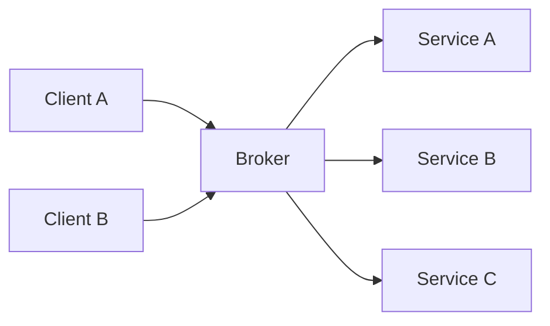
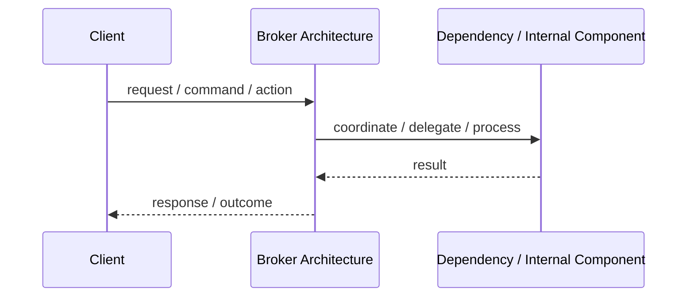
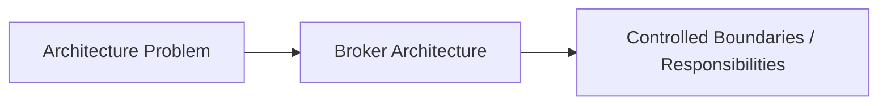

# Broker Architecture

## Core Idea

Broker Architecture uses a broker to coordinate communication between clients and services so they do not need to know each other's location or implementation.

---

## Problem It Solves

Clients need to call services in a distributed system without being tightly coupled to service locations, protocols, or implementations.

---

## Common Examples

- Message broker
- Object request broker
- Service registry and broker

---

## Architect Questions

- Who discovers services?
- Should clients know service locations?
- What protocol does the broker mediate?
- Is communication synchronous or asynchronous?
- Can the broker become a bottleneck?
- How will routing, retries, and failures be handled?

---

## Main Diagram



---

## Runtime / Responsibility Flow



---

## Implementation Shape

```txt
1. Identify the main architectural problem.
2. Identify the primary responsibilities.
3. Define boundaries and contracts.
4. Decide communication style.
5. Decide ownership of state and data.
6. Add operational rules: testing, deployment, monitoring, failure handling.
7. Keep the pattern honest; do not use the name without enforcing the rules.
```

---

## When to Use

- Distributed components need decoupled communication.
- Service location should be hidden.
- Routing or mediation is needed.
- Clients and services should evolve independently.

---

## When Not to Use

- Direct calls are simpler and sufficient.
- The broker would become a single point of failure.
- The system cannot tolerate broker latency or operational complexity.

---

## Common Smell That Suggests This Pattern

```txt
The current design is forcing one part of the system to know too much,
coordinate too much,
or change too often because boundaries are unclear.
```

---

## Common Mistakes

```txt
Using the pattern name without enforcing its boundaries.

Adding complexity before the problem is real.

Letting shared code, shared databases, or hidden dependencies break the architecture.

Confusing folder structure with actual architecture.

Ignoring operational concerns such as deployment, monitoring, scaling, and failure behavior.
```

---

## Best Visual Summary



## Final Meaning

Broker Architecture is useful when it directly solves the stated problem. If the problem is not real yet, the pattern may only add complexity.
