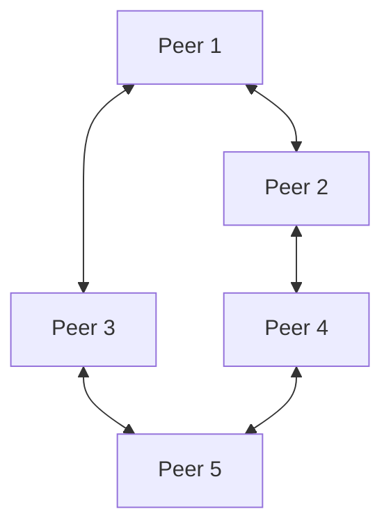
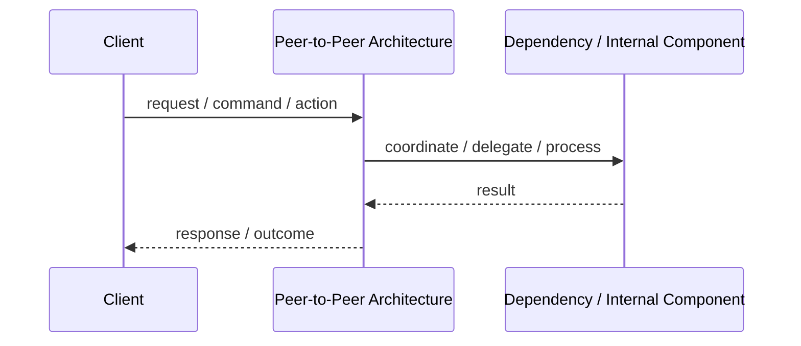
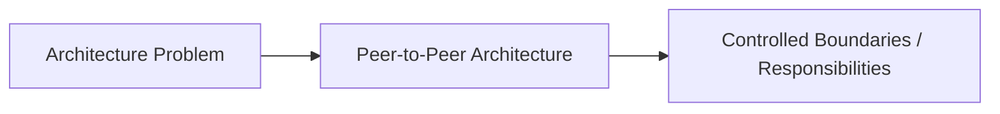

# Peer-to-Peer Architecture

## Core Idea

Peer-to-Peer Architecture connects nodes that can act as both clients and servers, sharing resources directly with each other.

---

## Problem It Solves

A system needs decentralized communication, resource sharing, or resilience without relying entirely on a central server.

---

## Common Examples

- File sharing networks
- Blockchain networks
- Collaborative peer synchronization

---

## Architect Questions

- Do nodes need to communicate directly?
- How will peers discover each other?
- How will trust and identity be handled?
- How will data consistency be maintained?
- What happens when peers leave or fail?
- Is decentralization worth the complexity?

---

## Main Diagram



---

## Runtime / Responsibility Flow



---

## Implementation Shape

```txt
1. Identify the main architectural problem.
2. Identify the primary responsibilities.
3. Define boundaries and contracts.
4. Decide communication style.
5. Decide ownership of state and data.
6. Add operational rules: testing, deployment, monitoring, failure handling.
7. Keep the pattern honest; do not use the name without enforcing the rules.
```

---

## When to Use

- Decentralization is required.
- Nodes can share resources directly.
- The system benefits from no single central dependency.
- Peers can tolerate partial failure and dynamic membership.

---

## When Not to Use

- Central coordination is simpler and acceptable.
- Security, trust, and consistency requirements are strict.
- Clients are unreliable or resource-constrained.

---

## Common Smell That Suggests This Pattern

```txt
The current design is forcing one part of the system to know too much,
coordinate too much,
or change too often because boundaries are unclear.
```

---

## Common Mistakes

```txt
Using the pattern name without enforcing its boundaries.

Adding complexity before the problem is real.

Letting shared code, shared databases, or hidden dependencies break the architecture.

Confusing folder structure with actual architecture.

Ignoring operational concerns such as deployment, monitoring, scaling, and failure behavior.
```

---

## Best Visual Summary



## Final Meaning

Peer-to-Peer Architecture is useful when it directly solves the stated problem. If the problem is not real yet, the pattern may only add complexity.
