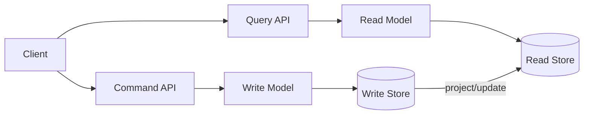
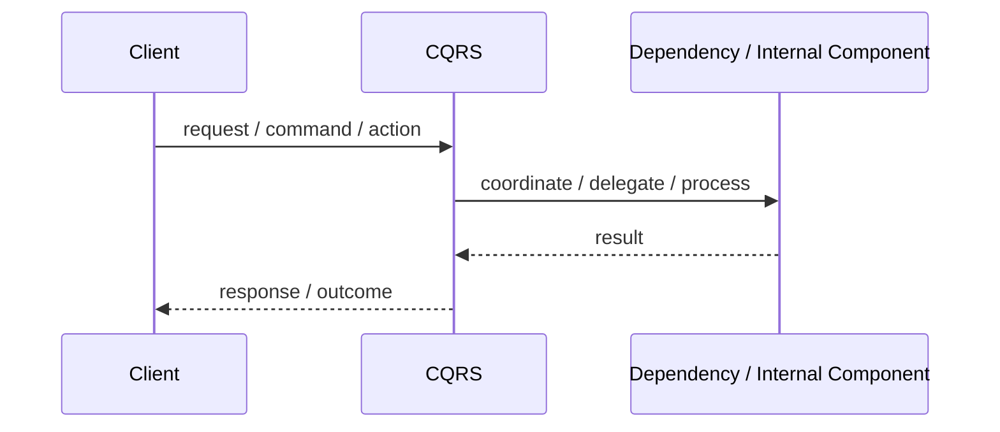
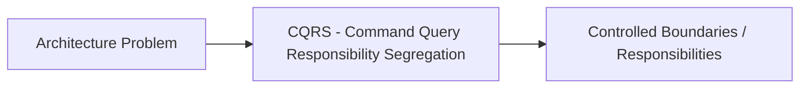

# CQRS - Command Query Responsibility Segregation

## Core Idea

CQRS separates write operations that change state from read operations that query state.

---

## Problem It Solves

A single model is struggling to handle both complex writes and optimized reads.

---

## Common Examples

- Commands update order state
- Read model optimized for dashboards
- Separate write model and query model

---

## Architect Questions

- Are read and write needs very different?
- Do queries need denormalized views?
- Are write rules complex?
- Can the system tolerate eventual consistency between write and read models?
- How are read models updated?
- Is CQRS worth the extra complexity?

---

## Main Diagram



---

## Runtime / Responsibility Flow



---

## Implementation Shape

```txt
1. Identify the main architectural problem.
2. Identify the primary responsibilities.
3. Define boundaries and contracts.
4. Decide communication style.
5. Decide ownership of state and data.
6. Add operational rules: testing, deployment, monitoring, failure handling.
7. Keep the pattern honest; do not use the name without enforcing the rules.
```

---

## When to Use

- Reads and writes have different performance or modeling needs.
- You need optimized read projections.
- Write-side business rules are complex.
- Eventual consistency is acceptable.

---

## When Not to Use

- Simple CRUD is enough.
- Immediate consistency between reads and writes is mandatory everywhere.
- The team does not need separate models.

---

## Common Smell That Suggests This Pattern

```txt
The current design is forcing one part of the system to know too much,
coordinate too much,
or change too often because boundaries are unclear.
```

---

## Common Mistakes

```txt
Using the pattern name without enforcing its boundaries.

Adding complexity before the problem is real.

Letting shared code, shared databases, or hidden dependencies break the architecture.

Confusing folder structure with actual architecture.

Ignoring operational concerns such as deployment, monitoring, scaling, and failure behavior.
```

---

## Best Visual Summary



## Final Meaning

CQRS - Command Query Responsibility Segregation is useful when it directly solves the stated problem. If the problem is not real yet, the pattern may only add complexity.
