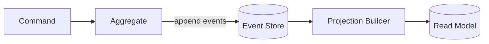
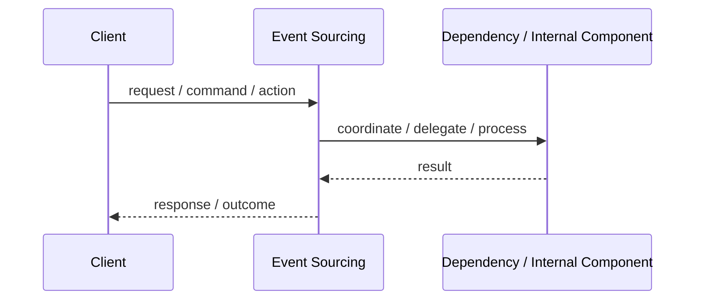
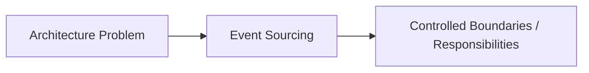

# Event Sourcing

## Core Idea

Event Sourcing stores changes as a sequence of events instead of storing only the current state.

---

## Problem It Solves

The system needs full history, auditability, replayability, and the ability to reconstruct state from business events.

---

## Common Examples

- Bank account ledger
- Order lifecycle history
- Audit-heavy compliance system

---

## Architect Questions

- What events represent real business facts?
- Can current state be rebuilt from events?
- How will event schemas evolve?
- Do we need snapshots for performance?
- How will projections be built?
- Can the team handle event replay and eventual consistency?

---

## Main Diagram



---

## Runtime / Responsibility Flow



---

## Implementation Shape

```txt
1. Identify the main architectural problem.
2. Identify the primary responsibilities.
3. Define boundaries and contracts.
4. Decide communication style.
5. Decide ownership of state and data.
6. Add operational rules: testing, deployment, monitoring, failure handling.
7. Keep the pattern honest; do not use the name without enforcing the rules.
```

---

## When to Use

- Audit history is critical.
- You need to reconstruct past state.
- Business events are first-class concepts.
- Replay and temporal debugging are valuable.

---

## When Not to Use

- Only current state matters.
- The domain events are unclear.
- Schema evolution and replay complexity are not justified.
- The team expects simple CRUD behavior.

---

## Common Smell That Suggests This Pattern

```txt
The current design is forcing one part of the system to know too much,
coordinate too much,
or change too often because boundaries are unclear.
```

---

## Common Mistakes

```txt
Using the pattern name without enforcing its boundaries.

Adding complexity before the problem is real.

Letting shared code, shared databases, or hidden dependencies break the architecture.

Confusing folder structure with actual architecture.

Ignoring operational concerns such as deployment, monitoring, scaling, and failure behavior.
```

---

## Best Visual Summary



## Final Meaning

Event Sourcing is useful when it directly solves the stated problem. If the problem is not real yet, the pattern may only add complexity.
