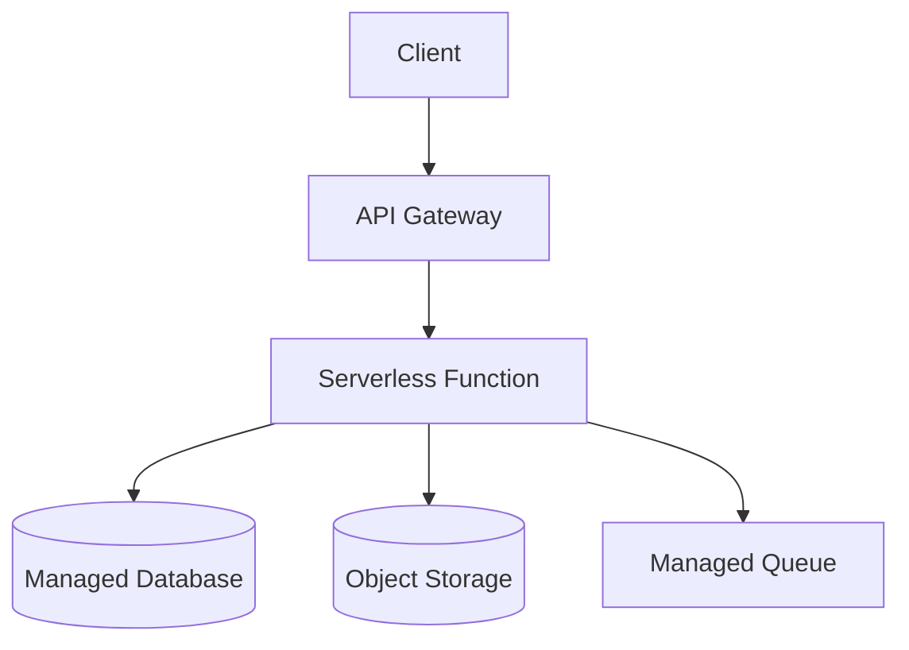
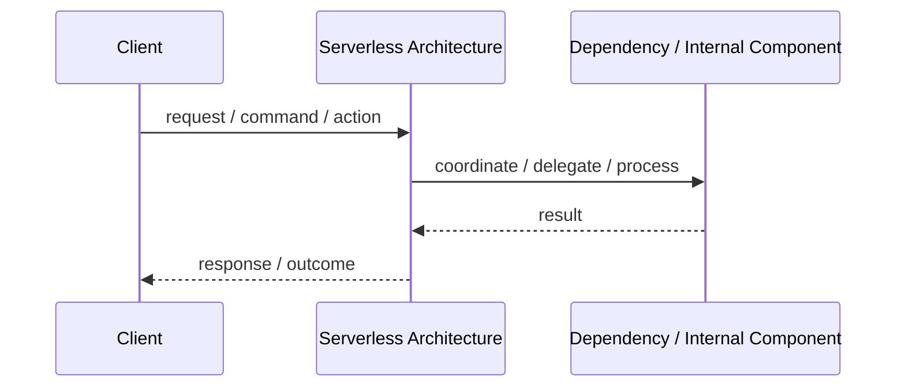
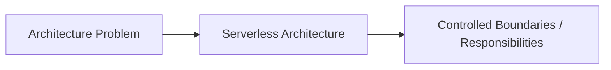

# Serverless Architecture

## Core Idea

Serverless Architecture runs application logic in managed functions or services where the cloud provider handles server provisioning and scaling.

---

## Problem It Solves

A team wants to run event-triggered or API-driven workloads without managing servers directly.

---

## Common Examples

- HTTP function
- File upload trigger
- Scheduled background task

---

## Architect Questions

- What triggers the function?
- Is the workload stateless?
- What are cold-start implications?
- How will state be stored externally?
- What are provider lock-in risks?
- How will observability and debugging work?

---

## Main Diagram



---

## Runtime / Responsibility Flow



---

## Implementation Shape

```txt
1. Identify the main architectural problem.
2. Identify the primary responsibilities.
3. Define boundaries and contracts.
4. Decide communication style.
5. Decide ownership of state and data.
6. Add operational rules: testing, deployment, monitoring, failure handling.
7. Keep the pattern honest; do not use the name without enforcing the rules.
```

---

## When to Use

- Workloads are event-driven or bursty.
- You want managed scaling.
- You want low operational overhead.
- The functions are stateless and short-lived.

---

## When Not to Use

- Long-running processes are required.
- Low latency is critical and cold starts are unacceptable.
- You need full control over runtime infrastructure.
- Provider lock-in is a major concern.

---

## Common Smell That Suggests This Pattern

```txt
The current design is forcing one part of the system to know too much,
coordinate too much,
or change too often because boundaries are unclear.
```

---

## Common Mistakes

```txt
Using the pattern name without enforcing its boundaries.

Adding complexity before the problem is real.

Letting shared code, shared databases, or hidden dependencies break the architecture.

Confusing folder structure with actual architecture.

Ignoring operational concerns such as deployment, monitoring, scaling, and failure behavior.
```

---

## Best Visual Summary



## Final Meaning

Serverless Architecture is useful when it directly solves the stated problem. If the problem is not real yet, the pattern may only add complexity.
