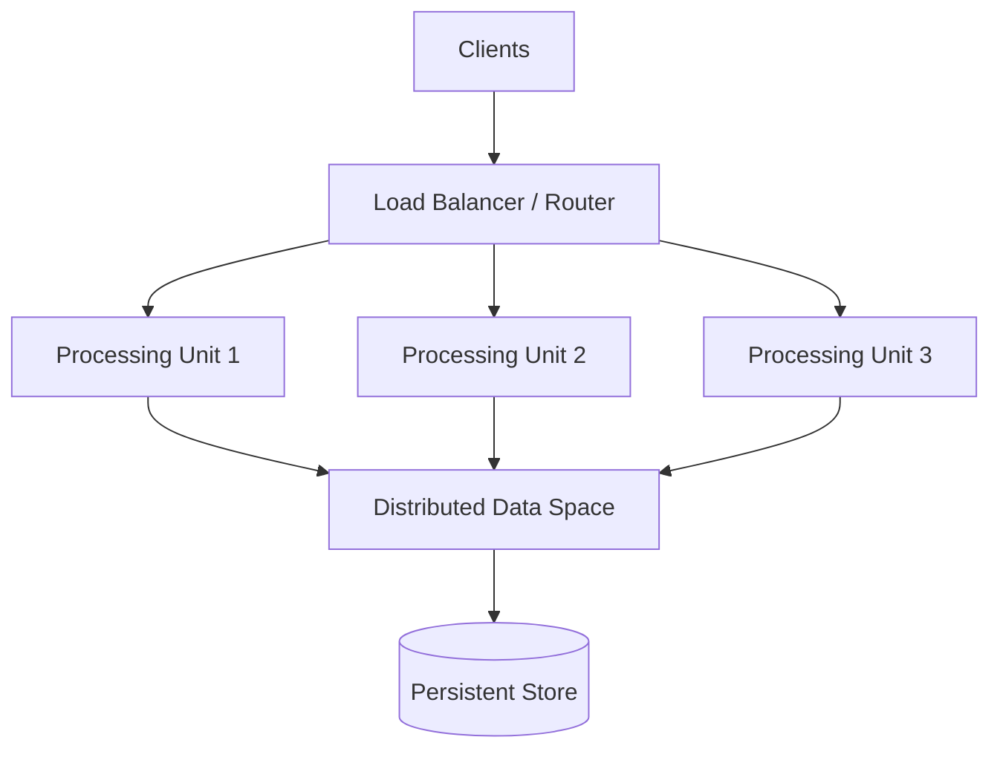
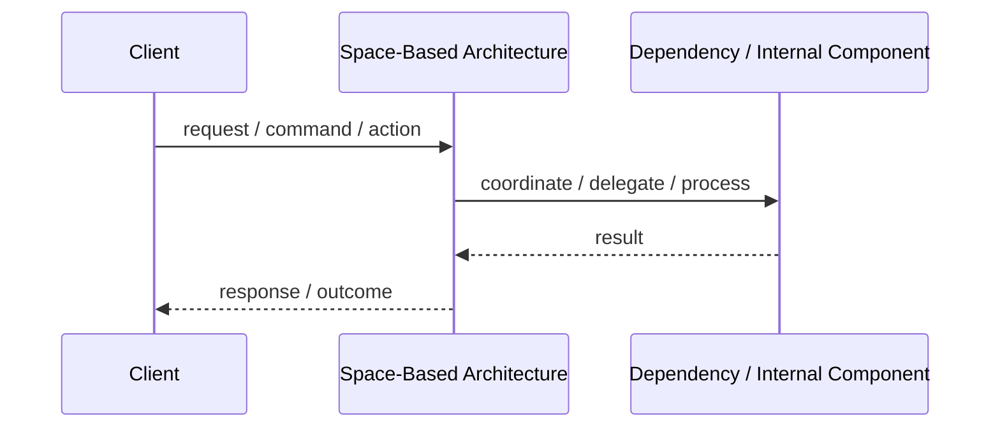

# Space-Based Architecture

## Core Idea

Space-Based Architecture distributes processing and state across multiple processing units to avoid database bottlenecks and support high scalability.

---

## Problem It Solves

A high-traffic system is bottlenecked by centralized database access and needs to scale horizontally under heavy load.

---

## Common Examples

- High-volume trading platform
- Ticketing system during peak sale
- Massive reservation system

---

## Architect Questions

- Is the database the main bottleneck?
- Can state be partitioned across memory/data grids?
- How will data be synchronized with persistent storage?
- Can the system tolerate eventual consistency?
- How will partitions and conflicts be handled?
- Is the scale requirement high enough to justify this complexity?

---

## Main Diagram



---

## Runtime / Responsibility Flow



---

## Implementation Shape

```txt
1. Identify the main architectural problem.
2. Identify the primary responsibilities.
3. Define boundaries and contracts.
4. Decide communication style.
5. Decide ownership of state and data.
6. Add operational rules: testing, deployment, monitoring, failure handling.
7. Keep the pattern honest; do not use the name without enforcing the rules.
```

---

## When to Use

- The system has extreme load.
- Central database bottlenecks block scaling.
- State can be partitioned or distributed.
- Eventual consistency is acceptable in parts of the system.

---

## When Not to Use

- Normal database scaling is enough.
- Strong consistency is required everywhere.
- The team cannot operate distributed state systems.
- The scale problem is theoretical, not real.

---

## Common Smell That Suggests This Pattern

```txt
The current design is forcing one part of the system to know too much,
coordinate too much,
or change too often because boundaries are unclear.
```

---

## Common Mistakes

```txt
Using the pattern name without enforcing its boundaries.

Adding complexity before the problem is real.

Letting shared code, shared databases, or hidden dependencies break the architecture.

Confusing folder structure with actual architecture.

Ignoring operational concerns such as deployment, monitoring, scaling, and failure behavior.
```

---

## Best Visual Summary


## Final Meaning

Space-Based Architecture is useful when it directly solves the stated problem. If the problem is not real yet, the pattern may only add complexity.
