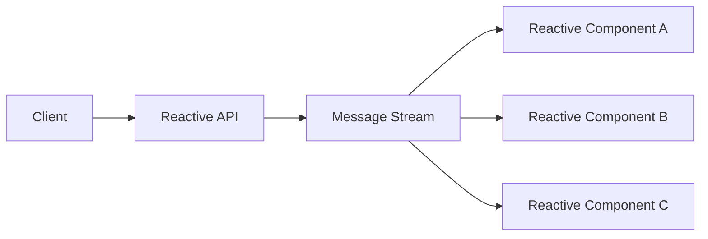
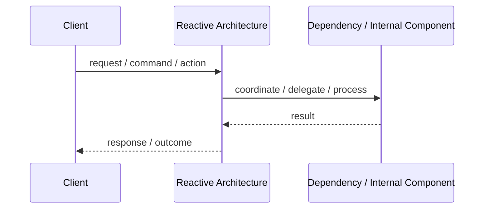
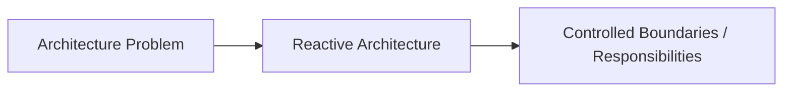

# Reactive Architecture

## Core Idea

Reactive Architecture designs systems to be responsive, resilient, elastic, and message-driven.

---

## Problem It Solves

A system must remain responsive under load, recover from failures, and handle asynchronous data flows.

---

## Common Examples

- Real-time dashboards
- Streaming systems
- Highly concurrent user systems

---

## Architect Questions

- What events or messages drive the system?
- How does the system remain responsive under load?
- How are failures isolated?
- Can components scale elastically?
- How is backpressure handled?
- Is asynchronous processing acceptable?

---

## Main Diagram



---

## Runtime / Responsibility Flow



---

## Implementation Shape

```txt
1. Identify the main architectural problem.
2. Identify the primary responsibilities.
3. Define boundaries and contracts.
4. Decide communication style.
5. Decide ownership of state and data.
6. Add operational rules: testing, deployment, monitoring, failure handling.
7. Keep the pattern honest; do not use the name without enforcing the rules.
```

---

## When to Use

- The system needs high responsiveness.
- The workload is asynchronous or streaming.
- Resilience and elasticity are important.
- Backpressure and non-blocking behavior matter.

---

## When Not to Use

- The system is simple request/response CRUD.
- The team is not ready for async complexity.
- Strong linear workflows are easier and sufficient.

---

## Common Smell That Suggests This Pattern

```txt
The current design is forcing one part of the system to know too much,
coordinate too much,
or change too often because boundaries are unclear.
```

---

## Common Mistakes

```txt
Using the pattern name without enforcing its boundaries.

Adding complexity before the problem is real.

Letting shared code, shared databases, or hidden dependencies break the architecture.

Confusing folder structure with actual architecture.

Ignoring operational concerns such as deployment, monitoring, scaling, and failure behavior.
```

---

## Best Visual Summary



## Final Meaning

Reactive Architecture is useful when it directly solves the stated problem. If the problem is not real yet, the pattern may only add complexity.
